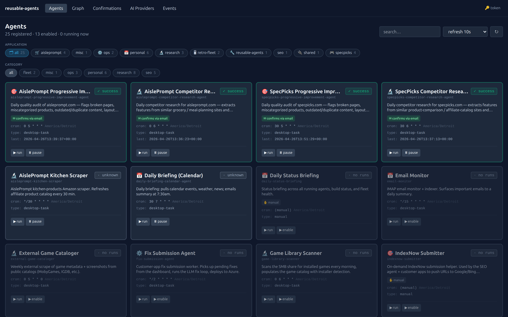
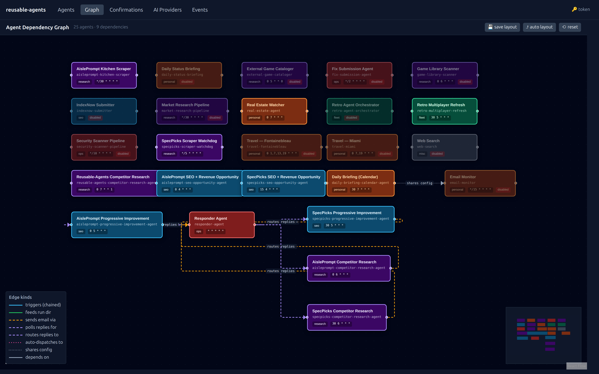
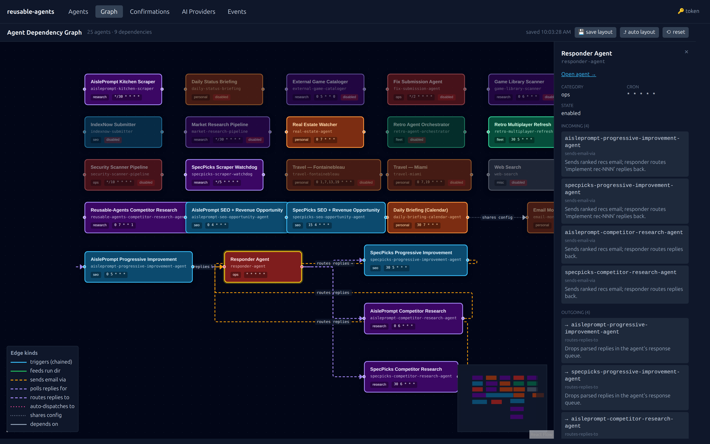
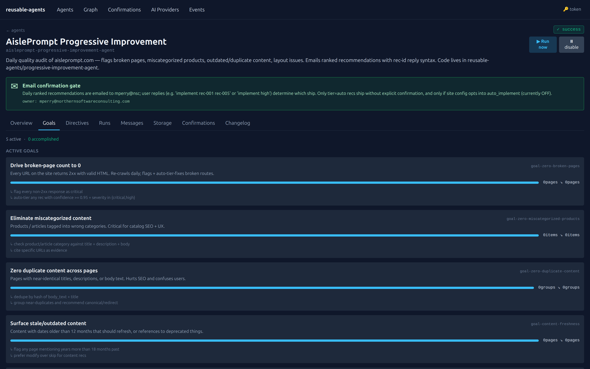
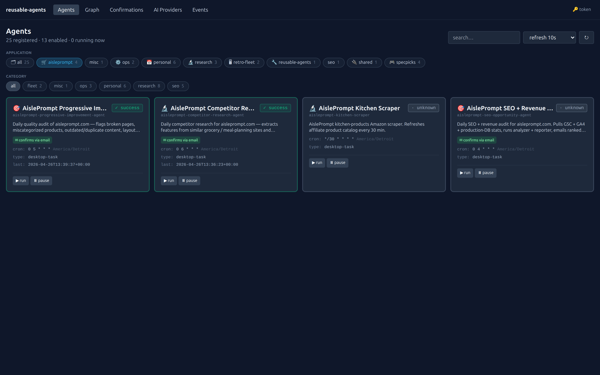

# reusable-agents

> A self-hostable framework for running LLM-driven agents with shared
> memory, scheduled execution, human-in-the-loop confirmations, and a
> control dashboard. Agents register with a local instance from their
> own repos, get auto-scheduled via systemd, and write all state to
> Azure Blob Storage so they get smarter over time.

## Dashboard at a glance

**Agent grid** — color-coded by category, glowing while running, with
filter pills for application (🛒 aisleprompt / 🎮 specpicks /
🔧 reusable-agents / etc.) and confirmation/queue-driven badges per
card:



**n8n-style dependency graph** — every agent is a node; edges show
pipeline triggers, email-confirmation flows, queue dispatches, and
shared-config ties. Drag-to-reposition with localStorage persistence,
auto-layout via elkjs, custom edge styles per relationship kind:



Click any node to see what it depends on + what it triggers:



**Per-agent detail** — overview with confirmation-flow banner,
dependencies, runs drill-down with per-run artifacts (recommendations,
emails, decision logs), and a Goals tab showing persistent objectives
with progress bars and 30-point sparklines:



Filtering the grid to a single application:




## Why

Most agent systems are monoliths. You install one product and your agents
have to live inside it. This framework inverts the relationship:

- **Your agent code lives in your own repo** (or wherever it makes sense
  for its problem domain).
- The framework runs **next to** your agents and provides the cross-cutting
  infrastructure: registration, scheduling, status, decision logs, message
  bus, confirmations for dangerous actions, an HTTP API + UI.
- Each repo POSTs its `manifest.json` files to the local framework
  instance and immediately gains: scheduled execution (systemd timers
  auto-wired), live status visibility (UI glows when working), a durable
  decision log, and inter-agent communication.

You can run one framework instance for personal projects, share it across
several of your repos (this codebase already does — `nsc-assistant`,
`specpicks`, etc. all register with the same instance), or fork it for
production deployments.

## What's in the box

```
reusable-agents/
├─ framework/
│  ├─ core/                  Importable Python package — the foundation
│  │   ├─ agent_base.py       AgentBase lifecycle (setup/pre_run/run/post_run/teardown)
│  │   ├─ storage.py          StorageBackend abstraction (Azure Blob + LocalFS)
│  │   ├─ registry.py         Master agent list (registry/agents.json in storage)
│  │   ├─ status.py           Live status writer + global event log
│  │   ├─ messaging.py        Inter-agent async messages (shared/messages/)
│  │   ├─ confirmations.py    @requires_confirmation decorator + approve/reject
│  │   ├─ decision_log.py     Per-run jsonl log + per-agent changelog
│  │   ├─ context_index.py    Date-indexed run summaries with daily rollups
│  │   ├─ scheduler.py        systemd --user timer/service writer (cron→OnCalendar)
│  │   ├─ release_tagger.py   git commit + tag agent/<id>/release/<run-ts> + push
│  │   ├─ email_codes.py      Subject-tag encode/decode, request-id generator
│  │   ├─ guardrails.py       Capability dataclass for declared dangerous methods
│  │   └─ mailer.py           Outbound mailer abstraction (LogMailer + Graph + SMTP)
│  ├─ api/                   FastAPI service (35 routes + 2 WebSockets)
│  │   ├─ Dockerfile          python:3.12-slim, non-root, healthcheck
│  │   ├─ host-worker.sh      Systemd-user service — exec triggers on host
│  │   └─ app/                Routes for agents/runs/status/messages/etc.
│  ├─ ui/                    React + Vite + Tailwind dashboard
│  │   ├─ Dockerfile          node:20 build → nginx:1.27-alpine, iframe-friendly
│  │   ├─ nginx.conf          Reverse-proxies /api + /ws to agent-api
│  │   └─ src/                AgentList, AgentDetail, Confirmations, Events
│  └─ tests/                 pytest suite — 20 tests cover core primitives
├─ blueprints/                Reusable agent-pattern templates (see blueprints/README.md)
│  ├─ site-quality-recommender/  Crawl + LLM analysis + email recs (auto-pilot capable)
│  ├─ pipeline-stage/             One step in a multi-stage pipeline (run-dir based)
│  ├─ inbox-poller/               IMAP loop, parses tagged subjects, dispatches replies
│  ├─ llm-code-editor/            Reads recs, drives LLM to apply edits, commits + deploys
│  └─ scheduled-task/             Default cron-driven script blueprint
├─ progressive-improvement-agent/  Reference impl of site-quality-recommender (audits)
├─ competitor-research-agent/      Reference impl of site-quality-recommender (competitor)
├─ seo-{data-collector,analyzer,reporter,implementer,deployer}/  Reference SEO pipeline
├─ responder-agent/                Reference impl of inbox-poller
├─ shared/
│  ├─ schemas/                  JSON schemas (recommendations + site config)
│  ├─ site_config.py            SEO site-config loader
│  └─ site_quality.py           Site-quality config loader + tier scoring + email render
├─ install/
│  ├─ register-agent.sh         POSTs one manifest.json to the framework
│  ├─ register-all-from-dir.sh  Walks a dir and registers every manifest.json
│  ├─ install-host-worker.sh    Sets up the host-worker systemd unit
│  ├─ install.sh                One-shot installer (validates env, brings up stack, seeds providers)
│  ├─ bootstrap-azure.sh        Creates Azure resource group + storage account + container
│  ├─ seed-providers.sh         Seeds AI provider skeletons (Azure / Anthropic / Ollama / Copilot / OpenAI)
│  └─ seed-providers-local.sh   Host-tailored seeder for the dev box
├─ docker-compose.yml           API + UI services
├─ .env.example                 Operator config template
└─ examples/sites/*.yaml        Per-site SEO config templates (legacy use)
```

## Quick start

### 1. Bring up the framework

```bash
git clone https://github.com/voidsstr/reusable-agents
cd reusable-agents

cp .env.example .env
$EDITOR .env                # set FRAMEWORK_API_TOKEN, AZURE_STORAGE_CONNECTION_STRING

docker compose up -d --build
```

The API runs on port 8090, the UI on 8091. If 8090 conflicts with another
service, override via `.env`:

```dotenv
# Anywhere in .env — the docker-compose ports are also configurable
FRAMEWORK_API_PORT=8093
```

### 2. Install the host-worker

The host-worker exec's "Run now" triggers on the host (not in the API
container) so agents get full access to docker, git, az, ssh, etc.

```bash
bash install/install-host-worker.sh
```

This writes `~/.config/systemd/user/reusable-agents-host-worker.service`
and starts it. Linger is enabled so it survives logout.

### 3. Register agents from your repos

In any repo that has agent definitions, run:

```bash
bash /path/to/reusable-agents/install/register-all-from-dir.sh ./agents
```

Or build a thin wrapper in the consuming repo (see
[`nsc-assistant/scripts/register-agents.sh`](https://github.com/voidsstr/nsc-assistant/blob/master/scripts/register-agents.sh)
for an example).

### 4. Open the UI

http://localhost:8091/

The card grid auto-glows when an agent is running. Click into an agent for
runbook, runs, decisions, messages, storage browser, confirmations, and
release changelog.

## Manifest format

Every agent dir has a `manifest.json` describing it:

```json
{
  "id": "specpicks-scraper-watchdog",
  "name": "SpecPicks Scraper Watchdog",
  "description": "Restarts the scraper container if it dies.",
  "category": "research",
  "task_type": "desktop-task",
  "cron_expr": "*/5 * * * *",
  "timezone": "America/Detroit",
  "enabled": true,
  "owner": "you@example.com",
  "runbook": "AGENT.md",
  "skill": "SKILL.md",
  "entry_command": "bash /absolute/path/to/agent/run.sh",
  "metadata": {
    "framework": "reusable-agents",
    "source_repo": "specpicks"
  }
}
```

Field reference:

| Field | Required | What |
|---|---|---|
| `id` | yes | Stable kebab-case id; primary key for the framework |
| `name` | yes | Display name for the UI |
| `description` | no | One-line summary |
| `category` | no | One of `seo / research / fleet / personal / ops / misc` (or your own) |
| `task_type` | no | `desktop-task` (host) / `cloud-routine` (Anthropic Routines) / `manual` |
| `cron_expr` | no | 5-field cron — auto-wires a systemd timer if set |
| `timezone` | no | IANA tz, default `UTC` |
| `enabled` | no | If false, schedule is registered but disabled |
| `owner` | no | Email — gets confirmation requests for dangerous actions |
| `runbook` | no | Path (relative to manifest dir) to AGENT.md, or use the convention |
| `skill` | no | Path to SKILL.md (Claude Desktop task definition) |
| `entry_command` | no | Shell command for the host-worker to exec on "Run now" |
| `metadata` | no | Free-form JSON — flow through to the registry |

## Storage layout

The framework writes everything to a single Azure Blob container (default
name `agents`). Hierarchical via key prefixes:

```
registry/
  agents.json                          # master agent list
  events.jsonl                         # framework event log

agents/<agent-id>/
  manifest.json                        # canonical manifest
  status.json                          # live status (UI reads)
  state/latest.json                    # carried-forward state
  state/history/<run-ts>.json
  goals/current.json
  goals/history/<run-ts>.json
  runs/<run-ts>/
    progress.json                      # success criteria, metrics
    errors.json                        # exceptions + tracebacks
    decisions.jsonl                    # streaming decision log
    context-summary.md                 # narrative for next run
    recommendations.json               # SEO-style recs (where applicable)
    responses.json                     # parsed user replies
    deploy.json                        # deployer artifacts
  context-summaries/<YYYY-MM-DD>.md    # daily rollups (smart cap on next-run context)
  changelog.jsonl                      # release tags + commits
  outbound-emails/<request-id>.json    # routing for replies
  responses-queue/<request-id>.json    # parsed user replies awaiting pickup
  confirmations/<request-id>.json      # pending dangerous-action approvals

shared/
  messages/<message-id>.json           # inter-agent async messages
  inboxes/<agent-id>/<message-id>      # zero-byte markers for fast inbox listing
```

Why blob keys instead of e.g. Storage Queues for messages:
- Indexable by date — agents pull a bounded window each run
- Auditable — humans can read everything in the portal
- No queue retention limits (Azure Queues cap at 7d)

## Creating a new agent (the standard flow)

The framework ships an `install/create-agent.sh` scaffold script that sets up
a new agent dir conforming to all framework standards (manifest format,
runbook conventions, entry-script shape, registration glue). Use this when
adding a new agent to ANY repo — your repo, my repo, doesn't matter.

**Pick a [blueprint](blueprints/README.md) first** — it determines the shape
of what you're building:

| You want to... | Blueprint |
|---|---|
| Crawl a site, identify issues, email ranked recs, gate ship-time on user replies | `site-quality-recommender` |
| Build one stage of a multi-step pipeline (reads upstream run-dir, writes downstream) | `pipeline-stage` |
| Poll an IMAP inbox, parse subject tags, route replies to other agents | `inbox-poller` |
| Read approved recs, drive an LLM to apply edits, commit + tag + deploy | `llm-code-editor` |
| Run a script on a cron schedule (the default) | `scheduled-task` |

See `blueprints/<name>/BLUEPRINT.md` for when each fits, what files come
out, and which existing agents are reference implementations.

```bash
# Python agent (subclasses AgentBase, gets full lifecycle for free)
bash /path/to/reusable-agents/install/create-agent.sh \
    my-new-agent /path/to/your-repo/agents \
    --name "My New Agent" \
    --description "Pulls X, computes Y, emits Z" \
    --category research \
    --cron "*/30 * * * *" \
    --timezone "America/Detroit" \
    --owner "you@example.com" \
    --kind python

# Bash agent (lighter weight; no AgentBase, just an entry script)
bash /path/to/reusable-agents/install/create-agent.sh \
    my-watchdog /path/to/your-repo/agents \
    --description "..." --kind bash --cron "*/5 * * * *"

# Auto-register immediately after scaffolding
bash /path/to/reusable-agents/install/create-agent.sh \
    my-new-agent /path/to/your-repo/agents \
    --description "..." --register
```

### What gets created

```
your-repo/agents/<agent-id>/
├── manifest.json          # registry metadata (already filled in from CLI args)
├── AGENT.md               # runbook stub with conventions for decisions, state, gates
├── SKILL.md               # Claude Desktop task definition (frontmatter + body)
├── agent.py               # AgentBase subclass with example status/decide/confirm calls
├── run.sh                 # entry script the framework's host-worker invokes
├── README.md              # quick reference card
└── requirements.txt       # extra Python deps the agent needs
```

For `--kind bash`, you get `run.sh` only (no `agent.py`).

### Standards every new agent follows

**Every agent MUST declare goals.** Goals are persistent objectives
that the agent's runs incrementally advance. The framework tracks
progress over time (with a sparkline + progress bar in the dashboard)
and graduates goals to "accomplished" once their metric target is hit.

```json
{
  "id": "goal-zero-broken-pages",
  "title": "Drive broken-page count to 0",
  "description": "Every URL on the site returns 2xx with valid HTML.",
  "metric": {
    "name": "broken_pages",
    "current": 12,
    "target": 0,
    "direction": "decrease",
    "unit": "pages",
    "horizon_weeks": 4
  },
  "directives": [
    "flag every non-2xx response as critical",
    "auto-tier any rec with confidence >= 0.95 + severity in {critical,high}"
  ]
}
```

Goal directives are pasted into the agent's LLM system prompt at run
start to bias analysis. The `run()` should end with a call to
`framework.core.goals.record_goal_progress(...)` for each goal, pushing
the new measurement.

Schema: `shared/schemas/agent-goals.schema.json`. Seed via
`install/seed-default-goals.sh` (idempotent — preserves history) or PUT
to `/api/agents/<id>/goals`.


1. **Kebab-case ID** — `my-new-agent`, not `MyNewAgent` or `my_new_agent`.
2. **Manifest schema** — see [Manifest format](#manifest-format) below. The
   scaffold pre-fills it from the CLI args you pass.
3. **AGENT.md sections** — every runbook has the same eight headings so a
   new reader can scan: *What this agent does · Schedule · Inputs/Outputs ·
   Per-run flow · Hard gates · State carried · Decisions to log · Goals*.
4. **Lifecycle** (Python agents) — implement `run()` returning a `RunResult`.
   The framework handles state load + response-queue drain + decision log
   + context summary + error capture + status updates.
5. **Capabilities declared** — list every meaningful method on the class
   with `declare(name, description, confirmation_required=...)`. The UI
   audits these.
6. **Confirmation-gated dangers** — wrap any production-affecting method
   with `@requires_confirmation(reason=...)`. The framework emails the
   owner; nothing happens until the owner approves (via email reply or
   the dashboard).
7. **Status reporting** — call `self.status("doing X", progress=0.5)`
   liberally. Drives the glow animation in the UI.
8. **Decision logging** — call `self.decide("plan"|"observation"|"choice"|...)`
   for anything a future run should know about.
9. **State persistence** — return `RunResult.next_state` for state to carry
   forward. Don't write directly to the filesystem; use storage abstraction.
10. **No `--no-verify`** on git commit (release-tagger enforces).

### Authoring without the scaffold

If you want to hand-roll an agent:

#### Subclass `AgentBase` (recommended for new agents)

```python
from framework.core.agent_base import AgentBase, RunResult
from framework.core.guardrails import declare

class SeoDeployer(AgentBase):
    agent_id = "seo-deployer"
    name = "SEO Deployer"
    category = "seo"
    capabilities = [
        declare("read_metrics", "Pull GSC + GA4 data"),
        declare("ship_to_prod", "Deploy a new container revision",
                confirmation_required=True, risk_level="high",
                affects=["production", "git", "billing"]),
    ]

    def run(self) -> RunResult:
        self.status("checking metrics", progress=0.2)
        self.decide("plan", "if delta < threshold, skip deploy")
        # … work …
        self.status("ready to ship", progress=0.9)
        return RunResult(status="success", summary="ok",
                         metrics={"changes_shipped": 0})

    @requires_confirmation(reason="deploys a new tag to production Azure")
    def ship_to_prod(self, tag: str): ...

if __name__ == "__main__":
    SeoDeployer().run_once()
```

Then add a `manifest.json` next to it and register:

```bash
bash /path/to/reusable-agents/install/register-agent.sh /path/to/your/agent
```

### Bash agents (lightweight option)

You don't have to subclass anything. Bash agents work fine — they just need
a `manifest.json` declaring `entry_command`. They won't get the AgentBase
lifecycle features (status, decisions, etc.) for free, but they're easy
to drop in.

## Email confirmation flow

For dangerous actions:

```
1. Agent calls @requires_confirmation method
2. Framework writes a pending confirmation to storage
3. Framework emails the agent's owner with subject [<agent-id>:<request-id>]
4. Owner replies "yes" / "no" — the responder agent picks it up via IMAP XOAUTH2
5. Responder writes the reply to <agent>/responses-queue/<request-id>.json
6. Next agent run's pre_run() drains the queue, resolves the confirmation
7. The originally-deferred call now succeeds (or raises ConfirmationRejected)
```

The same flow can be UI-driven: the dashboard's `Confirmations` page has
approve/reject buttons that write directly to storage, bypassing email.

## Inter-agent messaging

```python
# Agent A
self.message(to=["agent-b"], kind="request", subject="please refresh",
             body={"site": "aisleprompt"})

# Agent B (next run)
for msg in self.inbox():
    if msg["kind"] == "request":
        # … handle …
        self.mark_message_read(msg["message_id"])
```

Messages persist in `shared/messages/` indefinitely — useful for analytics
("what did agent X tell agent Y last month?"). Threading via `in_reply_to`.

## Composability with other systems

- **Existing scripts**: register a manifest pointing at your existing
  bash/python script. Zero refactor.
- **Microsoft Graph email**: the framework's mailer ships a Graph sendMail
  implementation with Send-As → Send-on-Behalf fallback.
- **OAuth2 IMAP**: the responder-agent dir has a complete XOAUTH2 setup
  for Office 365 + Google Workspace (one-time browser bootstrap, refresh
  tokens auto-rotate).
- **Anthropic Routines / Desktop Scheduled Tasks**: declare `task_type:
  cloud-routine` in the manifest and provide `routine_id` + `trigger_url`
  + `trigger_token_env`; the framework's trigger endpoint POSTs to
  Anthropic's `/fire` API instead of the host-worker queue.

## Operational rules

- Never `--no-verify` on git commit — release-tagger fails the run if hooks fail.
- Hard cap on agent decisions per run is configurable; default 50 to keep
  the decision log scannable.
- Status writes are throttled to ≤1/s per agent to avoid blob churn —
  terminal states (success/failure/blocked/cancelled) are always flushed.
- Cron expressions auto-translate to systemd OnCalendar; complex Quartz
  extensions (`L`, `W`, `?`, `#`) aren't supported — write the timer by hand
  if you need them.

## Contributing

This codebase is shared across several of my own repos but designed to be
fork-friendly. Open issues / PRs at https://github.com/voidsstr/reusable-agents.

If you build an interesting agent on top of it, I'd love to see it.

## License

MIT — see [LICENSE](LICENSE).
