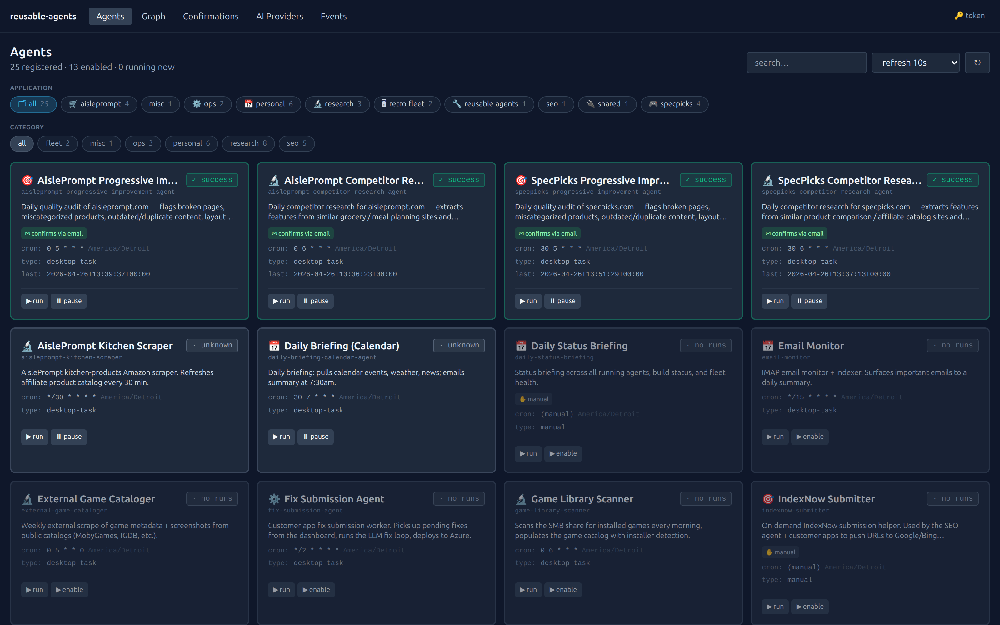
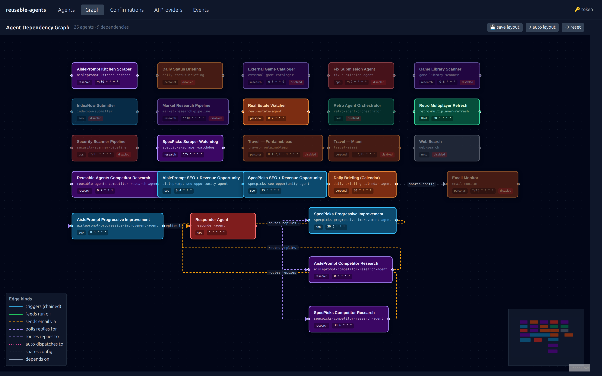
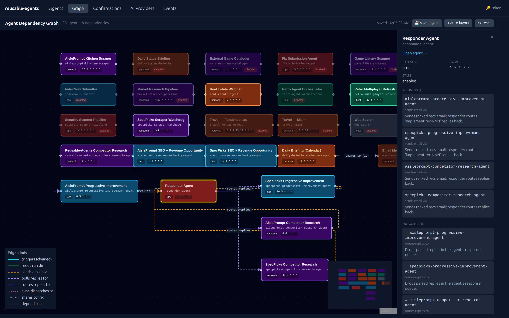
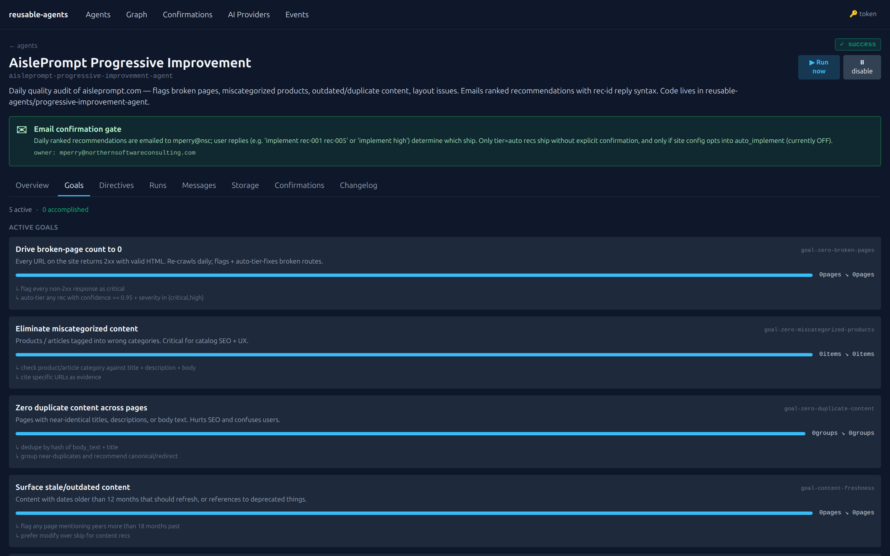
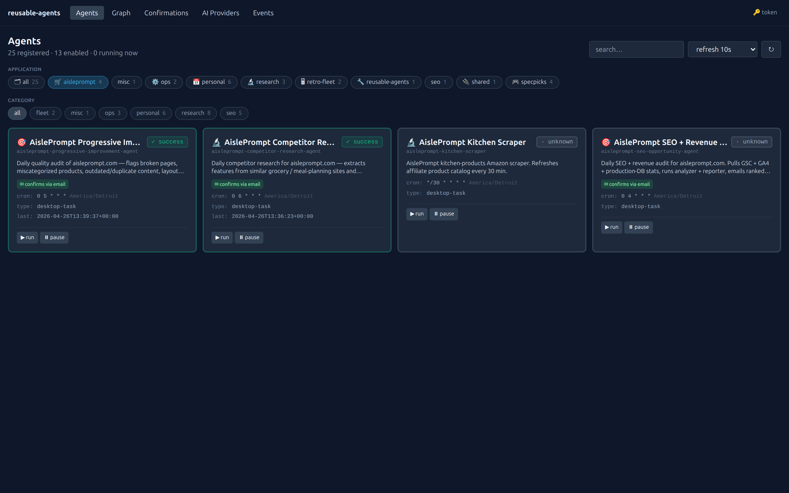

# reusable-agents

> A self-hostable framework for running LLM-driven agents with shared
> memory, scheduled execution, human-in-the-loop confirmations, and a
> control dashboard. Agents register with a local instance from their
> own repos, get auto-scheduled via systemd, and write all state to
> Azure Blob Storage so they get smarter over time.

_Last audited against the code, the registry and the fleet host's systemd
units on 2026-09-23. Operator rules (the North Star, AgentBase, framework-first,
Opus-only authoring) live in [`CLAUDE.md`](CLAUDE.md)._

## The agent system at a glance

### The runtime loop

1. **Schedule.** Each registered agent with a cron gets
   `agent-<id>.timer` and `agent-<id>.service` in `~/.config/systemd/user/`
   on the fleet host. On 2026-09-23 there were 69 timers: 67 enabled, 2
   disabled. The service runs
   `framework/agent_run_wrapper.sh <id> <entry_command>` with
   `EnvironmentFile=-~/.reusable-agents/secrets.env` and logs to
   `/tmp/reusable-agents-logs/agent-<id>.log`. Timers fire in **host-local
   time**; the scheduler ignores the manifest `timezone`.
2. **Run.** Most agents subclass `framework.core.agent_base.AgentBase`
   (required for new ones; a few script-style agents remain on the
   `CLAUDE.md` conversion backlog):
   - `pre_run()` loads state and drains confirmations, responses and handoffs.
   - `run()` does the work.
   - `post_run()` writes `progress.json`, `run-index.json`, carried state and
     goal progress to storage (Azure Blob container `agents`).
3. **Recommend.** Producers write `recommendations.json` into their run
   dir. The backlog-dispatcher walks 13 producer ids (`PRODUCER_AGENT_IDS`):
   the per-site SEO, progressive-improvement, competitor-research,
   catalog-audit, article-proposal and feedback-triage agents, plus
   `specpicks-category-integrity-agent`. Some agents, such as
   `shelf-audit-agent` with `dispatch_findings: true`, dispatch their own
   findings instead.
4. **Dispatch.** `backlog-dispatcher-agent` runs every minute. It collects
   recs nobody has dispatched and calls `framework.core.dispatch.dispatch_now()`,
   which starts the implementer in a transient
   `systemd-run --user --scope` unit. Recs queued through
   `implementation_queue.queue_recs()`, and spawns that fail, land in
   `agents/responder-agent/auto-queue/`. `auto-queue-drainer.service` drains
   that queue.
5. **Implement and ship.** The implementer edits the site repo. It tries the
   claude-pool first and the framework code-editor chain second.
   **Opus-required authoring defers instead of downgrading.** Code changes
   are committed and chained to the deployer
   (`test → build → push → deploy → smoke_check`). Article, H2H and
   catalog-audit work lands as DB rows.
6. **Report.** Agent mail is queued to `digest-queue/`, because
   `DIGEST_ONLY` defaults on. `digest-rollup-agent` sends it once a day at
   07:30. `goals-tracker` mails the daily goals roll-up, and `agent-doctor`
   triages failed runs.
7. **Observe.** The dashboard (Azure Container App `agents`, deployed by
   `install/deploy-azure.sh`) reads the same storage. "Run now" writes a job
   under `_trigger-queue/`, which the host-worker on the fleet host pulls
   and executes.

**Always-on units on the fleet host:**

| Unit | What it runs |
|---|---|
| `reusable-agents-api.service` | Framework API: `uvicorn framework.api.app.main:app` on `127.0.0.1:8090`, run natively rather than via docker compose. Handles the registry, status, goals and triggers, and writes the systemd units at registration. |
| `reusable-agents-host-worker.service` | `framework/api/host-worker.sh`. Executes Run-now/API triggers from `/tmp/agent-trigger-queue/` and the `_trigger-queue/` blob prefix, polling every 15 s. |
| `auto-queue-drainer.service` | `python3 -m framework.cli.auto_queue_drainer --interval 15 --idle-backoff 60` |

Standing up or rebuilding the host: `install/standup-fleet-host.sh`
(phases `preflight repos deps secrets api register spine verify`), with
[`docs/fleet-host-standup.md`](docs/fleet-host-standup.md) and
`.claude/skills/provision-fleet/SKILL.md`. On-call runbook:
[`docs/keep-the-lights-on.md`](docs/keep-the-lights-on.md).

### Where agents live

| Repo | What lives in `agents/` | Timers (2026-09-23) |
|---|---|---|
| `reusable-agents` (this repo) | Framework agents, the shared engines, the chained implementer and deployer, and a legacy analyzer copy. **Index: [`agents/README.md`](agents/README.md).** | 8 (1 disabled) |
| `aisleprompt` | AislePrompt instances of the shared engines (`manifest.json` + `site.yaml` pointing at an engine here) plus AislePrompt-only agents | 22 |
| `specpicks` | SpecPicks instances of the shared engines plus SpecPicks-only agents | 31 (1 disabled) |
| `nsc-assistant` | Thin `run.sh` wrappers that register `goals-tracker`, `agent-metrics-collector` and the SpecPicks gsc-coverage, indexnow and site-goals instances, plus two non-site timers | 8 |

34 of the 69 timers run code from `reusable-agents/agents/`; the other 35
run site-specific code in the site repos.

### Where the catalog and runbooks are

- [`agents/README.md`](agents/README.md): every dir in this repo's `agents/`,
  with kind, schedule, status, the per-site instances of each engine, and
  links to runbooks.
- Per agent: `AGENT.md` or `README.md` next to the code. For a per-site
  instance, the runbook is in the instance dir in the site repo.
- [`docs/agents-catalog.md`](docs/agents-catalog.md): the fleet-wide
  catalog, with one row per timer for all 69, grouped by function. It was
  re-verified on 2026-09-23. Status columns are snapshots; check them
  against `systemctl --user list-timers` or `GET /api/agents`.
- Live truth: `GET http://127.0.0.1:8090/api/agents[/<id>]` (bearer
  `FRAMEWORK_API_TOKEN`) and the dashboard.

## Dashboard at a glance

**Agent grid** — color-coded by category, glowing while running, with
filter pills for application (🛒 aisleprompt / 🎮 specpicks /
🔧 reusable-agents / etc.) and confirmation/queue-driven badges per
card:



**n8n-style dependency graph** — every agent is a node; edges show
pipeline triggers, email-confirmation flows, queue dispatches, and
shared-config ties. Drag-to-reposition with localStorage persistence,
auto-layout via elkjs, custom edge styles per relationship kind:



Click any node to see what it depends on + what it triggers:



**Per-agent detail** — overview with confirmation-flow banner,
dependencies, runs drill-down with per-run artifacts (recommendations,
emails, decision logs), and a Goals tab showing persistent objectives
with progress bars and 30-point sparklines:



Filtering the grid to a single application:




## Why

Most agent systems are monoliths. You install one product and your agents
have to live inside it. This framework inverts the relationship:

- **Your agent code lives in your own repo** (or wherever it makes sense
  for its problem domain).
- The framework runs **next to** your agents and provides the cross-cutting
  infrastructure: registration, scheduling, status, decision logs, message
  bus, confirmations for dangerous actions, an HTTP API + UI.
- Each repo POSTs its `manifest.json` files to the local framework
  instance and immediately gains: scheduled execution (systemd timers
  auto-wired), live status visibility (UI glows when working), a durable
  decision log, and inter-agent communication.

You can run one framework instance for personal projects, share it across
several of your repos (this codebase already does — `aisleprompt`,
`specpicks` and `nsc-assistant` all register with the same instance), or
fork it for production deployments.

## Live deployments

This framework runs in production for two sites:

- **🛒 [aisleprompt.com](https://aisleprompt.com)**, an AI meal planner that
  builds your Instacart cart.
- **🎮 [specpicks.com](https://specpicks.com)**, PC-hardware buying guides
  and comparisons.

For both sites, agents curate the catalog, optimize SEO, propose and write
articles, and ship code edits to the site repos. Schedules range from every
minute to weekly.

Everything runs on a single fleet host:
- **Scheduled runs** are fired directly by per-agent systemd `--user` timers.
- **The host-worker** executes dashboard and API "Run now" triggers.
- **Implementer dispatches** each run in their own `systemd-run --user
  --scope`, so one batch can crash without affecting the rest.

The Container App that serves the dashboard is self-deployed via
`install/deploy-azure.sh` (resource group `nsc-apps`, app `agents`).

## Goals & metrics — the north star

Every agent in this framework exists to drive **user usage of the
configured websites** (currently aisleprompt.com, specpicks.com; new
sites slot in via per-site config). Code volume, fancy LLM pipelines,
and run frequency are not goals — usage on the live site is. Every
new agent and every change to an existing agent must answer: *what
declared goal does this advance, by how much per run?*

### The pipeline

```
   ┌─────────────┐                ┌──────────────────┐
   │ agent.run() │ → returns →   │ RunResult.metrics │
   └─────────────┘                │ {key: float, …}  │
                                  └────────┬─────────┘
                                           │ (auto-tracked by AgentBase.post_run)
                                           ▼
   ┌─────────────────────┐   key matches   ┌────────────────────┐
   │ goal.target_metric  │ ◄────────────── │ active goal set    │
   │ "key"               │                 │ /api/agents/<id>/  │
   └─────────────────────┘                 │   goals            │
                                           └────────┬───────────┘
                                                    │
                                                    ▼
                                  framework.core.goals.record_goal_progress()
                                                    │
                       ┌────────────────────────────┼────────────────────┐
                       ▼                            ▼                    ▼
       progress_history (last N)      goal-progress.json/run     goals/timeseries-cache.json
       in active.json                 (per-run snapshot)         (fast UI reads via
       drives % to target             fed to dashboard           metric_helper; served at
                                      time-series chart          GET …/goals/cache)
```

### The contract every agent honours

1. **Declare 3–7 goals** at registration via `PUT /api/agents/<id>/goals`
   (or seed via `install/seed-default-goals.sh`). Each goal has:
   - `id` (kebab-case, stable, never reused)
   - `title` + `description`
   - `metric: {name, current, target, direction, unit, horizon_weeks}`
   - `target_metric` (top-level): the **key in `RunResult.metrics`** that
     advances this goal each run. Without this, the goal can't auto-tick.
   - `directives: list[str]` — what the agent should DO each run to
     advance this goal. Read by the agent's LLM at run start.
2. **Emit a numeric `metrics` dict** on `RunResult`. Every key the
   declared goals reference must appear here. Non-AgentBase scripts must
   record progress themselves, either by POSTing to
   `/api/agents/<id>/goals/<goal_id>/progress` or by calling
   `framework.core.metric_helper.record_many()`. `site-goals-tracker` and
   `agent-metrics-collector` use `record_many()`.
3. **Stay legible.** The dashboard's Goals tab is the single pane of
   glass for "is this agent moving the needle?" Fancy work that doesn't
   move a metric is invisible — and effectively didn't happen.

### Layers of metric capture

- **Layer A — explicit per-run scoring** (`runs/<ts>/goal-progress.json`).
  Used by SEO analyzer-style agents that compute a multi-dimensional
  score. Wins over Layer B when both fire.
- **Layer B — implicit auto-track** from `RunResult.metrics`. Walks the
  agent's active goals, looks up `target_metric` in metrics, records.
  This is the default path; *use this unless you have a reason not to.*
- **Cache layer** (`framework/core/metric_helper.py`) maintains a
  pre-aggregated time-series so the Goals tab loads in one storage call
  instead of walking every run dir.

### When goals drift

Goals stick around forever; that's deliberate (so progress is
comparable across months). But if a goal's `target_metric` no longer
maps to a real metric — or a metric was renamed — re-`PUT` the goal
set. As of `framework/core/goals.py` the merge updates top-level fields
(target_metric, baseline, target, direction…) on existing IDs, so
re-seeding actually persists.

### The prioritization rule

When choosing what to build next, scan the Goals tab first. **Stalled
goals are the work.** Pick the goal whose target gap × user impact is
largest, then trace it backward: which agent owns the metric? what's
its bottleneck? *That* is the next change. For worked examples, see
[`docs/keep-the-lights-on.md` → "Worked examples (shipped while on call)"](docs/keep-the-lights-on.md#worked-examples-shipped-while-on-call).

## Documentation

| Doc | What you read it for |
|---|---|
| **[`docs/architecture.md`](docs/architecture.md)** | The big-picture map: framework + customer repos + Azure storage, lifecycle of one agent run, end-to-end trace of how a SEO recommendation moves through the system. **Start here.** Audited against the code and the fleet host on 2026-09-23. |
| **[`agents/README.md`](agents/README.md)** | **Index of every dir in this repo's `agents/`.** Covers framework agents, shared engines and the per-site instances that run them, chained agents, blueprints and the archive. Each entry has its schedule, 2026-09-23 status and runbook link, followed by how to add and register an agent. |
| **[`docs/agents-catalog.md`](docs/agents-catalog.md)** | Fleet-wide catalog of all 69 registered timers, grouped by function, with repo, schedule, purpose, 2026-09-23 state and runbook. Re-verified 2026-09-23 (the previous 2026-05-13 edition missed most timers). For the dirs in this repo, `agents/README.md` also covers engines, blueprints and the archive. |
| **[`docs/repo-boundaries.md`](docs/repo-boundaries.md)** | What goes in `reusable-agents/` vs in a customer repo (specpicks, nsc-assistant) vs in `~/.reusable-agents/` (per-host). Decision tree + side-by-side examples + common mistakes. |
| **[`docs/fleet-host-standup.md`](docs/fleet-host-standup.md)** | The 2026-08 fleet-host rebuild: what the host is responsible for, the operator checklist, and the incidents. Partly superseded by `.claude/skills/provision-fleet/SKILL.md`; the script is `install/standup-fleet-host.sh`. |
| **[`docs/keep-the-lights-on.md`](docs/keep-the-lights-on.md)** | The 24/7 on-call (KTLO) runbook: starting a session, the live systems, the incident playbook index, GSC and claude-pool re-auth, and the improve-toward-goals workflow with worked examples. |
| **[`docs/decommissioned-services.md`](docs/decommissioned-services.md)** | Services retired to cut Azure spend: where their data went and how to stand them back up. |
| **[`docs/seo-onboard-new-site.md`](docs/seo-onboard-new-site.md)** | Step-by-step: add a new site to the SEO agent in 5 commands. |
| **[`docs/reference-app-architecture.md`](docs/reference-app-architecture.md)** | The "what every new app we ship looks like" reference (it mirrors aisleprompt's stack), used by `app-store-opportunity-agent` blueprints and the implementer. |
| **[`docs/implementer-app-build-contract.md`](docs/implementer-app-build-contract.md)** | Spec for the `app-build-from-blueprint` rec type. Spec only; the implementer has no handler for it yet. |
| **[`SCHEDULING.md`](SCHEDULING.md)** | How `cron_expr` becomes systemd `--user` timers. Last updated 2026-04-28. |
| **[`blueprints/README.md`](blueprints/README.md)** | Blueprint patterns and when to pick each. It indexes five (site-quality-recommender, pipeline-stage, inbox-poller, llm-code-editor, scheduled-task). Two more live in `blueprints/`: `app-store-opportunity-finder` and `competitor-research-with-accumulator`. |
| **[`shared/schemas/site-config.schema.json`](shared/schemas/site-config.schema.json)** | The canonical `site.yaml` schema for the SEO agent. Blocks with `additionalProperties:false` reject unknown keys at agent start-up. |
| **[`examples/deployer/README.md`](examples/deployer/README.md)** | Deployer recipes (Azure Container Apps active; the others are samples). |
| **[`install/glitchtip/README.md`](install/glitchtip/README.md)** | Optional self-hosted error tracker (Sentry-API-compatible). 4-container compose, Cloudflare-Tunnel ingress recipe, and the mobile-SDK wiring checklist (with aisleprompt as the worked example). Its `crash-watcher-agent` sections are stale: that agent was removed on 2026-07-06. |
| **[`CLAUDE.md`](CLAUDE.md)** | Instructions for Claude Code when working in this repo, including the North Star, the AgentBase and framework-first rules, queue and priority mechanics, and Opus-only authoring. References the docs above. |
| **`.claude/skills/`** | Operator runbooks as Claude skills: `provision-fleet`, `setup-fleet-host`, `keep-the-lights-on`, `check-website-agents`, `refresh-gsc-token`, `add-claude-max-profile`. |

## What's in the box

```
reusable-agents/
├─ framework/
│  ├─ core/                  Importable Python package — the foundation
│  │   ├─ agent_base.py       AgentBase lifecycle (setup/pre_run/run/post_run/teardown)
│  │   ├─ storage.py          StorageBackend abstraction (Azure Blob + LocalFS)
│  │   ├─ registry.py         Master agent list (registry/agents.json in storage)
│  │   ├─ status.py           Live status writer + global event log
│  │   ├─ messaging.py        Inter-agent async messages (shared/messages/)
│  │   ├─ confirmations.py    @requires_confirmation decorator + approve/reject
│  │   ├─ decision_log.py     Per-run jsonl log + per-agent changelog
│  │   ├─ context_index.py    Date-indexed run summaries with daily rollups
│  │   ├─ scheduler.py        systemd --user timer/service writer (cron→OnCalendar)
│  │   ├─ release_tagger.py   git commit + tag agent/<id>/release/<run-ts> + push
│  │   ├─ email_codes.py      Subject-tag encode/decode, request-id generator
│  │   ├─ guardrails.py       Capability dataclass for declared dangerous methods
│  │   ├─ mailer.py           Mailer ABC + LogMailer (storage-only, for tests)
│  │   ├─ completion_email.py Real send path: Graph sendMail (Send-As → Send-on-Behalf → self),
│  │   │                        msmtp fallback, DIGEST_ONLY gate → digest-queue/
│  │   └─ …                   64 modules in total (dispatch, handoff, priority, goals,
│  │                            metric_helper, ai_providers, code_editor, required_model,
│  │                            implementer_scope, short_circuit, …); see the CLAUDE.md cheat sheet
│  ├─ cli/                   14 entry points (auto_queue_drainer, claude_pool, priority, status,
│  │                            pull_blob_triggers, code_edit, …) — run as `python3 -m framework.cli.<name>`
│  ├─ agent_run_wrapper.sh   ExecStart wrapper for every scheduled agent (writes starting/final status)
│  ├─ api/                   FastAPI service (16 route modules, ~88 HTTP routes + 2 WebSockets)
│  │   ├─ Dockerfile          python:3.12-slim, non-root, healthcheck
│  │   ├─ host-worker.sh      Systemd-user service — exec Run-now / API triggers on host
│  │   └─ app/                Routes for agents/runs/status/goals/providers/messages/etc.
│  ├─ ui/                    React + Vite + Tailwind dashboard
│  │   ├─ Dockerfile          node:20 build → nginx:1.27-alpine, iframe-friendly
│  │   ├─ nginx.conf          Reverse-proxies /api + /ws to agent-api
│  │   └─ src/pages/          AgentList, AgentDetail, Graph, Goals, Runs, Confirmations,
│  │                            Events, ImplementerQueue, Providers, AgentLLMs, Settings
│  └─ tests/                 pytest suite — 13 test_*.py modules + conftest.py, 120 test functions (2026-09-23)
├─ blueprints/                Reusable agent-pattern templates (see blueprints/README.md)
│  ├─ site-quality-recommender/  Crawl + LLM analysis + email recs (auto-pilot capable)
│  ├─ pipeline-stage/             One step in a multi-stage pipeline (run-dir based)
│  ├─ inbox-poller/               IMAP loop, parses tagged subjects, dispatches replies
│  ├─ llm-code-editor/            Reads recs, drives LLM to apply edits, commits + deploys
│  ├─ scheduled-task/             Default cron-driven script blueprint
│  ├─ app-store-opportunity-finder/          App-store gap scout (ref: app-store-opportunity-agent)
│  └─ competitor-research-with-accumulator/  Cross-run proposal accumulator (ref: competitor-research-agent)
├─ agents/                       Framework agents + shared engines — indexed in agents/README.md
│  ├─ seo-opportunity-agent/          Shared SEO engine (collect → analyze → finalize); per-site instances
│  ├─ progressive-improvement-agent/  Shared engine, reference impl of site-quality-recommender (audits)
│  ├─ competitor-research-agent/      Shared engine, reference impl of site-quality-recommender (competitor)
│  ├─ implementer/ + deployer/        Chained LLM editor + ship step
│  ├─ backlog-dispatcher-agent/       Every-minute rec → implementer dispatcher
│  ├─ responder-agent/                Reference impl of inbox-poller
│  ├─ …                               27 agent dirs in total; see agents/README.md
│  └─ _archive/                       Retired agent dirs (not registered)
├─ _template/agent/              Scaffold copied by install/create-agent.sh
├─ shared/
│  ├─ schemas/                  JSON schemas (recommendations, responses, goals, goal-changes,
│  │                              site config, site-quality config)
│  ├─ site_config.py            SEO site-config loader (validates against site-config.schema.json)
│  ├─ site_quality.py           Site-quality config loader + tier scoring + email render
│  └─ run_files.py              Run-dir file helpers (agent_recorder.py is legacy)
├─ install/
│  ├─ create-agent.sh           Scaffold a new agent from _template/agent
│  ├─ register-agent.sh         POSTs one manifest.json to the framework
│  ├─ register-all-from-dir.sh  Walks a dir and registers every manifest.json (skips blueprints)
│  ├─ standup-fleet-host.sh     Phased fleet-host bring-up (preflight … verify | all)
│  ├─ recover-credentials.sh    Rebuild ~/.reusable-agents/secrets.env on a fresh host
│  ├─ install-host-worker.sh    Sets up the host-worker systemd unit
│  ├─ install.sh                One-shot installer (validates env, brings up stack, seeds providers)
│  ├─ bootstrap.sh              Interactive 7-step bootstrap (see Quick start)
│  ├─ bootstrap-azure.sh        Creates Azure resource group + storage account + container
│  ├─ deploy-azure.sh / deploy-aws.sh   Build + ship the dashboard (Azure active; AWS parallel target)
│  ├─ agents-pause.sh / agents-resume.sh / agents-resume-at.sh   Pause + restore the fleet's timers
│  ├─ add-claude-profile.sh     Log in one more Claude Max profile for the claude-pool
│  ├─ seed-default-goals.sh     Idempotent goal seeding (init_goals merges by goal id)
│  ├─ seed-providers.sh         Seeds AI provider skeletons (Azure / Anthropic / Ollama / Copilot / OpenAI)
│  └─ seed-providers-local.sh   Host-tailored seeder for the dev box
├─ services/                    local-image-gen (SDXL-Turbo daemon, :7861) + searxng config
├─ docker-compose.yml           API (:8090) + UI (:8091) services
├─ .env.example                 Operator config template
└─ examples/
   ├─ sites/*.yaml              Per-site configs. Still live: the implementer falls back to
   │                              examples/sites/<site>.yaml when a dispatch sets no SEO_AGENT_CONFIG
   └─ deployer/*.yaml           Deployer recipes (see "Deploying applications" below)
```

## Quick start

### One-command bootstrap

```bash
git clone https://github.com/voidsstr/reusable-agents
cd reusable-agents
bash install/bootstrap.sh
```

The bootstrap walks you through everything in 7 prompted steps:

1. **Prereq check** — python3, docker + compose, optional az/claude
2. **`.env` creation** with a freshly-generated API token
3. **Storage backend** — `local` (filesystem, zero deps) or `azure`
   (Blob Storage; pluggable for S3 / GCS / R2 — see below)
4. **AI provider auth** — claude-pool init, OpenAI/Anthropic/Azure keys
5. **Email OAuth** (optional) — pointer to `setup-microsoft-oauth.sh`
6. **`docker compose up -d --build`**. `docker-compose.yml` publishes the
   API on `:8090` and the UI on `:8091`. `bootstrap.sh` still points at
   `:8093` in three places: its health probe, the "API healthy" line it
   prints after the probe, and the closing "API health" line. Use
   `http://localhost:8090/api/health` instead.
7. **Host worker** — systemd-user service that exec's agent runs on the host

When it finishes, open <http://localhost:8091> and you're up.

> **Fleet host (production) path.** The production fleet host doesn't use
> docker compose for the API. Registration writes systemd units into
> `~/.config/systemd/user`, which a container can't reach, and docker is
> often unavailable under WSL. So `install/standup-fleet-host.sh api` runs
> the API natively as `reusable-agents-api.service` on `127.0.0.1:8090`.
> The dashboard UI is served from the Azure Container App. Use
> `bash install/standup-fleet-host.sh all` there; see
> [`docs/fleet-host-standup.md`](docs/fleet-host-standup.md).

For non-interactive (CI / Dockerfile RUN) mode:

```bash
bash install/bootstrap.sh --non-interactive
```

(Reads everything from `.env`; fails fast if anything's missing.)

### Manual install (if you want to know what bootstrap does)

```bash
cp .env.example .env
$EDITOR .env                                   # see Configuration § below
docker compose up -d --build                   # API on :8090, UI on :8091
bash install/install-host-worker.sh            # systemd-user agent executor
bash install/register-all-from-dir.sh ./agents # register this repo's agents
```

`register-all-from-dir.sh` skips subdirs with no `manifest.json` and
manifests flagged `metadata.is_blueprint`. Engine manifests without that
flag (`catalog-audit-agent`, `ebay-product-sync-agent`, `shelf-audit-agent`)
do get registered, but they have no cron, so they get no timer. Per-site
instances are registered from their own repos. On the production host,
re-registering `digest-rollup-agent` as-is disables its timer: its manifest
says `enabled=false`, and only a host drop-in keeps it running. See
[`agents/README.md`](agents/README.md#7-adding-and-registering-an-agent).

### Configuring storage (pluggable)

Three options, controlled by `STORAGE_BACKEND` in `.env`:

| Backend | Setup | Best for |
|---|---|---|
| `local` | `STORAGE_BACKEND=local`. Writes under `AGENT_STORAGE_LOCAL_PATH`. The code default is `~/.reusable-agents/storage`, but `host-worker.sh` and the implementer default it to `~/.reusable-agents/data`. | Dev, single-host, no external deps |
| `azure` | `STORAGE_BACKEND=azure` + `AZURE_STORAGE_CONNECTION_STRING` + `AZURE_STORAGE_CONTAINER` (default `agents`) | Production / multi-host. The fleet uses this. |
| **Custom** (S3, GCS, R2, MinIO) | Implement `framework.core.storage.StorageBackend`, register at startup | When you need a different cloud |

When `STORAGE_BACKEND` is unset, `get_storage()` picks `azure` if
`AZURE_STORAGE_CONNECTION_STRING` is set, otherwise `local`. Both
`docker-compose.yml` and `.env.example` default to `azure`. `list_prefix()`
returns at most 10,000 keys per call (its `limit` argument).

Custom backend example:

```python
# my_app/storage_s3.py
from framework.core.storage import StorageBackend, register_backend

class S3Backend(StorageBackend):
    name = "s3"
    def read_json(self, key): ...
    def write_json(self, key, value): ...
    def list_prefix(self, prefix): ...
    # ... see framework/core/storage.py for the full interface

register_backend("s3", lambda: S3Backend(bucket=os.environ["S3_BUCKET"]))
```

Then `STORAGE_BACKEND=s3` in `.env` and import your module before any
agent code calls `get_storage()`. The framework ships zero S3 glue —
write your own (≈100 lines) so the boto3 dep stays optional.

### Configuring email (optional)

Two scripts; same Azure App Registration, different scopes:

```bash
# Set in .env first:
#   MS_GRAPH_CLIENT_ID=<your-azure-app-client-id>
#   MS_GRAPH_TENANT_ID=<your-tenant-id>
#   MS_GRAPH_SIGNIN_HINT=<mailbox-to-send-from-and-poll>
bash install/setup-microsoft-oauth.sh   # outbound (Mail.Send via Graph)
bash install/setup-imap-oauth.sh        # inbound  (IMAP polling)
```

The Azure App Registration needs these delegated permissions:
`Mail.Send`, `Mail.Send.Shared`, `IMAP.AccessAsUser.All`, `offline_access`.
Both scripts use the device-code OAuth flow — works over SSH, no
localhost callback needed.

The send path is `framework/core/completion_email.py`: Graph `sendMail`
first, msmtp second. With `DIGEST_ONLY=1` (the default), mail is queued to
`digest-queue/` for `digest-rollup-agent`. On the fleet host (2026-09-23),
Graph sends with `~/.reusable-agents/responder/.oauth.json`. There is no
`~/.msmtprc`, so the msmtp fallback isn't configured. Fleet-wide recipient
policy: see "Outbound-email recipient policy" in [`CLAUDE.md`](CLAUDE.md).

### Configuring error tracking (optional)

GlitchTip — a Sentry-API-compatible error tracker — ships as an opt-in
companion. Bring it up with:

```bash
bash install/glitchtip/install.sh
```

That starts 4 containers (web, worker, postgres, redis, ~300 MB RAM)
on `http://localhost:8095`. Sentry-API-compatible means the same
`@sentry/react-native`, `@sentry/python`, etc. SDKs work with no code
changes — just point the DSN at the local instance.

**The companion `crash-watcher-agent` no longer exists.** It polled the
GlitchTip/Sentry API every 10 minutes and dispatched `crash-fix` recs to
the implementer. It was removed on 2026-07-06 (commit `c23317e`) because no
Sentry/GlitchTip backend was ever configured and it failed every run.
Remnants that remain:
- the `crash-fix` entries under `implementer.scope_by_dispatch_kind`;
- the `SENTRY_*` / `CRASH_WATCHER_TARGET_SITE` passthroughs in
  `host-worker.sh`.

To bring the crash → fix → ship loop back, restore the agent from git
history and configure a backend.

Full setup — public-ingress recipe (Cloudflare Tunnel), first-run UI
steps, mobile-SDK wiring checklist (with aisleprompt as the worked
example), retention/backup notes — lives in
**[`install/glitchtip/README.md`](install/glitchtip/README.md)**. That
README still describes crash-watcher as present.

### Configuring AI providers

Chat agents call the provider resolved for them first; the live default on
2026-09-23 is `claude-cli` / `claude-sonnet-4-6`, which goes through the
claude-pool. On a rate-limit, timeout or quota error,
`chat_with_fallback` walks the other registered kinds in
`DEFAULT_FALLBACK_KINDS` order: `copilot → ollama → azure_openai → openai →
anthropic`. The implementer has a separate code-editor chain:
`claude-cli → jcode-copilot → aider-github-copilot → aider-azure →
jcode-ollama`, both in code and in the live config. Both chains honour
environment variables and per-deployment config in storage. Metered kinds
(`openai`, `azure_openai`, `anthropic`) are skipped when they have no key.

Set any of:

```dotenv
# Pick one or more — agents fall over in DEFAULT_FALLBACK_KINDS order
ANTHROPIC_API_KEY=sk-ant-...
OPENAI_API_KEY=sk-...
AZURE_OPENAI_API_KEY=...
AZURE_OPENAI_ENDPOINT=https://your-resource.openai.azure.com
# Free local fallback:
OLLAMA_HOST=http://localhost:11434
```

Providers themselves are records in storage (`config/ai-providers.json`,
seeded by `install/seed-providers.sh` and editable at `/providers`). Each
record names its key via `api_key_env`. For framework chat calls, the
Ollama endpoint is the provider record's `base_url`. `OLLAMA_HOST` is read
only by some site scripts, such as the hero-image and recipe-image
verifiers.

Claude Max users have three ways to add profiles:
- `python3 -m framework.cli.claude_pool init --count N` creates profile
  dirs and prints the login commands.
- `bash install/add-claude-profile.sh` logs in one more profile
  interactively. It needs a real terminal; see
  `.claude/skills/add-claude-max-profile`.
- `python3 -m framework.cli.claude_pool login-help` prints the
  `HOME=… claude /login` commands.

The pool round-robins across authenticated profiles
(`~/.reusable-agents/claude-pool/profile-1` … `profile-5` on the fleet
host). When every profile is rate-limited it waits, bounded by
`CLAUDE_POOL_MAX_WAIT_S`. With `CLAUDE_POOL_FAIL_FAST=1` it exits `rc=75`
instead, so the caller can fall back. See `framework/cli/claude_pool.py`.

### Open the dashboard

<http://localhost:8091/> — agent grid, dependency graph, runs, decisions,
messages, knowledge tab, confirmations. That URL is for a local compose
install. The production fleet's dashboard is the Azure Container App
`agents`.

## Manifest format

Every agent dir has a `manifest.json` describing it:

```json
{
  "id": "specpicks-scraper-watchdog",
  "name": "SpecPicks Scraper Watchdog",
  "description": "Restarts the scraper container if it dies.",
  "category": "research",
  "task_type": "desktop-task",
  "cron_expr": "*/5 * * * *",
  "timezone": "America/Detroit",
  "enabled": true,
  "owner": "you@example.com",
  "runbook": "AGENT.md",
  "skill": "SKILL.md",
  "entry_command": "bash /absolute/path/to/agent/run.sh",
  "metadata": {
    "framework": "reusable-agents",
    "source_repo": "specpicks"
  }
}
```

Field reference:

The fields below are what `install/register-agent.sh` forwards to
`POST /api/agents/register`. The stored record is
`framework.core.registry.AgentManifest`.

| Field | Required | What |
|---|---|---|
| `id` | yes | Stable kebab-case id; primary key for the framework |
| `name` | no | Display name for the UI. `register-agent.sh` defaults it to `id`. |
| `description` | no | One-line summary |
| `category` | no | One of `seo / research / fleet / personal / ops / misc` (or your own). Default `misc`. |
| `task_type` | no | Free-form label, default `desktop-task`. Values in use: `desktop-task`, `scheduled-cron`, `manual`. The registry also names `cloud-routine` and `service`, but nothing acts on `cloud-routine` (see "Composability" below). |
| `cron_expr` | no | 5-field cron. Auto-wires `agent-<id>.timer` when `entry_command` is also set. |
| `timezone` | no | IANA tz, default `UTC`. **Stored and shown only.** `scheduler.py` writes `OnCalendar=` without a zone, so timers fire in host-local time (America/Detroit on the fleet host). |
| `enabled` | no | Default true. If false, the units are written but the timer is stopped and disabled. |
| `owner` | no | Email of the human owner, used for confirmation requests. Mail recipients follow the fleet policy in `CLAUDE.md`. |
| `runbook` | no | Path (relative to the manifest dir) to the runbook. Falls back to `AGENT.md`, then `README.md`. The body is embedded at `agents/<id>/runbook.md`. |
| `skill` | no | Path to `SKILL.md` (Claude Desktop task definition). Embedded at `agents/<id>/skill.md`. |
| `entry_command` | no | Shell command run by the systemd service (through `agent_run_wrapper.sh`) and by the host-worker on "Run now". A leading `VAR=value` prefix is wrapped in `/bin/sh -c`. |
| `runnable_modes` | no | Subset of `cron`, `manual`, `chained`; default `["cron","manual"]`. Without `manual`, the trigger endpoint returns 409. |
| `confirmation_flow` | no | `{enabled, kind, description, owner_email}`. Shown on the dashboard. `kind` ∈ `email-recommendations`, `per-action`, `preview-mode`, `none`. |
| `depends_on` | no | Graph edges `{agent_id, kind, description?}`. `kind` ∈ `triggers`, `feeds-run-dir`, `polls-replies-for`, `routes-replies-to`, `dispatches-to`, `sends-email-via`, `config-shared-with`. |
| `target_metric` | no | The site-goals-tracker goal id this agent is meant to move. Used for dashboard grouping only; it is not auto-attributed. |
| `metadata` | no | Free-form JSON passed through to the registry. Known keys: `metadata.ai.{provider,model}` (see below) and `metadata.is_blueprint`, which `register-all-from-dir.sh` skips. |

`AgentManifest` also has `priority_tier`, `code_editor_chain`,
`capabilities`, `routine_id`, `trigger_url` and `trigger_token_env`.
`priority.py` and `code_editor.py` read `priority_tier` and
`code_editor_chain` from the **stored** manifest. However, neither
`register-agent.sh` nor the register endpoint forwards them (checked
2026-09-23), so putting them in `manifest.json` alone has no effect. Use
`config/priority-config.json` and `config/code-editor-config.json` in
storage instead.

## Where everything lives

When an agent runs there are three places state lands: **agent data**
(the canonical, durable home in the framework storage backend), **logs**
(transient process output on the host), and **config** (some in the
storage backend, some in version-controlled repos, some on the host).
This section is the operator reference for finding any of it.

### 1. Agent data — Azure Blob (`agents` container)

Everything an agent produces or accumulates lives here. One container,
hierarchical by key prefix. The backend is selected via env: azure when
`AZURE_STORAGE_CONNECTION_STRING` is set, otherwise local FS at
`AGENT_STORAGE_LOCAL_PATH`. See "Configuring storage" above for the
default-path caveat. The fleet uses storage account `nscagentstorage`,
container `agents`.

```
registry/
  agents.json                          # master registry — every registered agent's manifest
  events.jsonl                         # global event log (state transitions, registrations, etc.)

config/
  ai-providers.json                    # registered AI providers (azure-openai, anthropic, ollama, copilot, claude-cli)
  ai-defaults.json                     # global default + per-agent overrides
  code-editor-config.json              # implementer code-editor chain + backends
  priority-config.json                 # implementer queue tier overrides (framework/core/priority.py)
  required-models.json                 # Opus-only dispatch kinds / agents (framework/core/required_model.py)

digest-queue/<ts>-<hash>.json          # mail held by DIGEST_ONLY for digest-rollup-agent
_trigger-queue/<agent>-<run-id>.json   # "Run now" jobs from the (Azure) API, pulled by the host-worker
framework/demand-signal/<site>.json    # search-demand-agent output (framework/core/demand_signal.py)
framework/defer-backoff/<agent>.json   # per-rec defer cooldowns (framework/core/defer_backoff.py)

agents/responder-agent/auto-queue/<request-id>.json   # pending implementer work (drained by
                                                      #   auto-queue-drainer.service)
agents/responder-agent/auto-queue-processed/          # history after ship

agents/<agent-id>/
  manifest.json                        # canonical manifest (mirror of registry/agents.json[id])
  status.json                          # current state, message, progress — what the dashboard reads
  runbook.md                           # the AGENT.md prompt (embedded at registration)
  skill.md                             # the SKILL.md prompt (embedded at registration)
  readme.md                            # human-readable overview (embedded at registration)

  run-index.json                       # one-read summary of the 50 most recent runs (dashboard + peers)
  live-llm-output.txt                  # rolling tail of the current run's LLM I/O (Live LLM tab)
  state/latest.json                    # carried-forward state (next-run uses this)
  state/history/<run-ts>.json          # snapshot per run for audit

  goals/active.json                    # long-running goals + current metric values
  goals/progress/<goal-id>.jsonl       # per-goal measurements (metric_helper)
  goals/timeseries-cache.json          # pre-aggregated series for the Goals tab
  goals/accomplished.jsonl             # append-only accomplishment log
  goals/changes.jsonl                  # append-only log of recs dispatched against goals,
                                       # with metric_before/after deltas (drives adaptive prompts)

  runs/<run-ts>/
    progress.json                      # start/end ts, status, metrics
    decisions.jsonl                    # streaming log of decisions/observations from the run
    llm-output.jsonl                   # every AIClient request/response (framework/core/llm_stream.py)
    context-summary.md                 # human-readable narrative for next run
    recommendations.json               # generated recs (SEO/PI/CR/catalog-audit)
    responses.json                     # parsed user replies for THIS run
    email-rendered.html                # body of the email this run sent (where applicable)
    pages.jsonl                        # crawl output (PI/CR)
    snapshot.json / comparison.json    # pre/post run diff (SEO)
    data/                              # raw ingest (GSC, GA4, etc.)
    deploy.json                        # deployer artifacts (where applicable)
    artifacts/*                        # agent-specific extras

  context-summaries/<YYYY-MM-DD>.md    # daily rollups (caps prompt size for older runs)
  changelog.jsonl                      # release tags + commit SHAs from production-affecting runs

  outbound-emails/<request-id>.json    # email metadata (subject, recipients, rec ids) — used to
                                       # route replies and render the dashboard's Confirmations tab
  responses-queue/<request-id>.json    # parsed user replies awaiting pickup by an implementer
  confirmations/<request-id>.json      # pending dangerous-action approvals (per-action gate)
  errors/<ts>-<class>.json             # unrecoverable errors recorded by the resilience layer

shared/
  messages/<message-id>.json           # inter-agent async messages (target_agent in body)
  inboxes/<agent-id>/<message-id>      # zero-byte markers for fast inbox listing
```

Why blob keys over Storage Queues for messages: indexable by date,
auditable in the portal, no 7-day queue retention cap.

### 2. Logs — host filesystem (`/tmp/reusable-agents-logs/`)

Process stdout/stderr that doesn't belong in durable storage. Cleared on
host reboot (every unit carries `ExecStartPre=-/bin/mkdir -p` so it
recreates the dir). The API reads the implementer dispatch logs here as the
last fallback for the dashboard's "Live LLM" tab. On the fleet host the API
runs natively; the compose file bind-mounts the dir read-only.

```
/tmp/reusable-agents-host-worker.log                          # host-worker service stdout/stderr
/tmp/reusable-agents-logs/agent-<id>.log                      # every scheduled run (systemd unit StandardOutput)
/tmp/reusable-agents-logs/<agent-id>-<run-id>.log             # one per host-worker run (Run now / API trigger)
/tmp/reusable-agents-logs/dispatch-implementer-<site>-<ts>.log
                                                              # transient implementer scope output
                                                              # (claude --print + tool calls)
/tmp/reusable-agents-logs/framework-api.log                   # reusable-agents-api.service
/tmp/reusable-agents-logs/auto-queue-drainer.log              # auto-queue-drainer.service
```

The **Live LLM** tab (`GET /api/agents/<id>/live-llm-output`) reads storage
first: the `agents/<id>/live-llm-output.txt` tail blob, then
`agents/<id>/runs/<latest-run>/llm-output.jsonl`. It falls back to the local
`dispatch-implementer-*.log` files only when neither exists, which covers
the implementer's shell-driven `claude --print` output. Decision logs
(`decisions.jsonl`) and progress JSONs go to **storage** (durable), not here.

### 3. Configuration — three layers

Config is split intentionally so secrets stay on the host, agent code
stays in version control, and per-instance settings stay in the repo
that owns the application.

#### 3a. Framework config (host + storage)

| What | Where | Purpose |
|---|---|---|
| **Fleet-host secrets + env** | `~/.reusable-agents/secrets.env` (host, mode 0600; values single-quoted) | The `EnvironmentFile=` of every `agent-<id>.service`, the API, the host-worker and the drainer. Holds `STORAGE_BACKEND`, `AZURE_STORAGE_*`, `FRAMEWORK_API_URL` / `FRAMEWORK_API_TOKEN`, `DATABASE_URL_<SITE>`, provider keys and more. Rebuild with `install/recover-credentials.sh`. |
| Storage backend choice + connection string (compose installs) | `reusable-agents/.env` (gitignored) | `STORAGE_BACKEND=azure`, `AZURE_STORAGE_CONNECTION_STRING=…`, `AZURE_STORAGE_CONTAINER=agents`, `FRAMEWORK_API_TOKEN=…`. The fleet host has no repo `.env`. |
| Host-worker systemd env | `~/.config/systemd/user/reusable-agents-host-worker.service` | Sources `secrets.env` so the host-worker writes to the same storage |
| Fleet PATH for systemd units | `~/.config/systemd/user/service.d/10-fleet-path.conf` | Global drop-in; systemd doesn't see nvm's node otherwise (see `CLAUDE.md`) |
| Per-timer host overrides | `~/.config/systemd/user/agent-<id>.timer.d/*.conf` | For example `digest-rollup-agent` (daily 07:30) and the GPU-stagger offsets on the image agents. Not in any repo, and not recreated by registration. |
| Docker-compose host overrides | `reusable-agents/docker-compose.override.yml` (gitignored) | Per-host port bindings, bind mounts |
| AI provider registry | `config/ai-providers.json` (storage, container `agents`) | Editable from the dashboard's AI Providers page |
| AI provider defaults / per-agent overrides | `config/ai-defaults.json` (storage) | Same, editable from UI |
| Code-editor chain, queue priority, required models | `config/code-editor-config.json`, `config/priority-config.json`, `config/required-models.json` (storage) | See "LLM provider chain" below and `CLAUDE.md` |
| Responder IMAP/OAuth config | `~/.reusable-agents/responder/config.yaml` (host, gitignored) | IMAP host, mailbox, oauth file path, dispatcher routes |
| Responder OAuth token | `~/.reusable-agents/responder/.oauth.json` (host, mode 0600) | XOAUTH2 refresh token; used by responder + Graph email send |

#### 3b. Reusable agent code

The reusable framework + agents repo (this repo). Cloned to a known
path on the host (default `/home/voidsstr/development/reusable-agents`).

```
reusable-agents/
  framework/                       # core lib (storage, status, registry, scheduler, …)
    api/                           # FastAPI service (Dockerized)
    ui/                            # React dashboard (Dockerized)
    core/                          # AgentBase, ai_providers, goals, goal_changes,
                                   #   email_codes, completion_email, resilience, …
  agents/<reusable-agent-id>/      # generic agent bodies (the goal is no per-site assumptions;
                                   #   a few still hard-code site values, see agents/README.md)
    agent.py                       # subclass of AgentBase
    AGENT.md                       # runbook prompt
    SKILL.md                       # task definition for Claude Desktop
    manifest.json                  # template manifest
    requirements.txt
    README.md
  shared/                          # cross-agent helpers (site_quality, run_files, schemas)
  blueprints/                      # cookiecutter-style templates for new agents
  install/                         # bootstrap scripts (create-agent.sh, install-host-worker.sh)
  examples/sites/<site>.yaml       # per-site configs; the implementer's fallback SEO_AGENT_CONFIG
```

Not every engine dir has every file listed above. Several have no
`manifest.json` at all; [`agents/README.md`](agents/README.md) says which.

#### 3c. Per-instance manifests + site configs

Per-app/site instances live in the repo that owns the application — NOT
in the reusable repo. This way each app's deploy pipeline carries its
own agent configs. Most live in `aisleprompt/agents/` and
`specpicks/agents/`. A few SpecPicks instances (gsc-coverage-auditor,
indexnow-submitter/bulk, site-goals-tracker) are still thin wrappers in
`nsc-assistant/agents/`.

```
aisleprompt/agents/<dir>/          # the id comes from manifest.json, usually aisleprompt-<dir>
  manifest.json                    # registers id, cron, owner, entry_command
  site.yaml                        # per-site config (DB env name, audit script command,
                                   #   reporter recipients, implementer repo path + scope)
  README.md or AGENT.md            # operator notes for THIS instance

specpicks/agents/<dir>/
  manifest.json
  site.yaml
  README.md or AGENT.md
```

The manifest's `entry_command` is what the systemd service (and the
host-worker, on "Run now") execs. For an instance it points back at the
shared engine in this repo:

```bash
# from aisleprompt/agents/progressive-improvement-agent/manifest.json:
"entry_command": "PROGRESSIVE_IMPROVEMENT_CONFIG=/home/voidsstr/development/aisleprompt/agents/progressive-improvement-agent/site.yaml \
                  python3 /home/voidsstr/development/reusable-agents/agents/progressive-improvement-agent/agent.py"
```

The absolute `/home/voidsstr/development` prefix is a contract; see
`install/standup-fleet-host.sh` for why the path must stay put. Keep
credentials out of `entry_command`: every agent unit already sources
`secrets.env`, so reference `$DATABASE_URL_<SITE>` there instead. Several
committed manifests still inline a DSN (2026-09-23), and the value is
echoed into the unit's `ExecStart`.

### Quick lookup — "I want to find X for agent Y"

| Looking for… | Path |
|---|---|
| Current state of agent | dashboard `/agents/<id>` (reads `agents/<id>/status.json` from storage) |
| Live LLM output during a run | dashboard `/agents/<id>` → "Live LLM" tab (storage `agents/<id>/live-llm-output.txt`, then the run's `llm-output.jsonl`, then `/tmp/reusable-agents-logs/dispatch-implementer-*.log`) |
| Why an agent failed last run | `agents/<id>/runs/<run-ts>/decisions.jsonl` + `agents/<id>/errors/<ts>-*.json` in storage |
| What recs the agent generated | `agents/<id>/runs/<run-ts>/recommendations.json` |
| What user replied to | `agents/<id>/runs/<run-ts>/responses.json` |
| Email metadata for routing replies | `agents/<id>/outbound-emails/<request-id>.json` |
| What's queued for the implementer | `agents/responder-agent/auto-queue/*.json` (Azure). Recs that backlog-dispatcher sends straight from producer run dirs never touch this queue; see dashboard `/implementer-queue`. |
| Goals + progress | `agents/<id>/goals/active.json` + `goals/changes.jsonl` |
| Agent's runbook prompt | `agents/<id>/runbook.md` (embedded at registration; the source of truth is the repo file named by `runbook_path`) |
| Cron schedule | `~/.config/systemd/user/agent-<id>.timer` (auto-wired from `manifest.cron_expr`) plus any `agent-<id>.timer.d/*.conf` drop-in; `systemctl --user list-timers --all` shows the effective next run |
| What code an instance runs | `systemctl --user cat agent-<id>.service` → `ExecStart` |
| Where an agent's code lives | [`agents/README.md`](agents/README.md), or `GET /api/agents/<id>` → `repo_dir` |
| Host-worker log | `/tmp/reusable-agents-host-worker.log` |
| Responder log | `/tmp/reusable-agents-logs/agent-responder-agent.log` |
| AI provider for an agent | dashboard `/providers`, or `GET /api/providers/resolve/<id>` |
| Storage browser | dashboard `/agents/<id>` → "Storage" tab |

## LLM provider chain — chat agents + code editor

There are two parallel routing systems, used by different agent shapes.
Both are configurable from the dashboard or storage; you don't edit
agent code to switch models.

### Chat-style agents — `framework.core.ai_providers`

Any agent that calls `self.ai_client(...)` or
`framework.core.ai_providers.chat_with_fallback(...)` (analyzers,
authors, audits, recommenders) routes through this.

| Provider kind | Backed by | Auth | When to pick |
|---|---|---|---|
| `copilot` | GitHub Copilot proxy (e.g. `copilot-api` on `:4141`) | Copilot Pro/Business subscription, no API key | First fallback kind. The registered `copilot` provider defaults to `gpt-4o`. Subscription billing — no per-call cost. |
| `anthropic` | Anthropic API (`claude-opus-5`, `claude-sonnet-4-6`, …) | `ANTHROPIC_API_KEY` | Highest-quality per-token. Pay-per-call. |
| `claude-cli` | Local `claude` CLI in `--print` mode, auto-routed through the claude-pool shim at `~/.reusable-agents/claude-pool/bin/claude` when present (`CLAUDE_CLI_CMD` overrides) | Claude Max login per pool profile | **Live global default (2026-09-23): `claude-cli` / `claude-sonnet-4-6`.** Subscription billing under Claude Max. **Per-account rate limits**, so the pool round-robins across accounts. |
| `azure_openai` | Azure OpenAI deployments | `AZURE_OPENAI_API_KEY` + endpoint | Enterprise-billed OpenAI access, Responses-API for codex. |
| `openai` | api.openai.com | `OPENAI_API_KEY` | Direct OpenAI billing. |
| `ollama` | Ollama server (`:11434`; the fleet registers `ollama-local`/`ollama-5090` on 127.0.0.1 and `ollama-small`/`ollama-4080` on a LAN box) | none | Free local inference (qwen3:8b / qwen3:14b in the 2026-09-23 registry). Privacy + zero cost. |

**Resolution order** for `ai_client_for(agent_id)` (operator config beats
the manifest since 2026-05-11):
1. Per-call `override_provider` / `override_model` args
2. `config/ai-defaults.json` `agent_overrides[<id>]`
3. Manifest `metadata.ai.{provider, model}`
4. `config/ai-defaults.json` `default_provider` / `default_model`

**Automatic fallback** via `chat_with_fallback(agent_id, messages, …)`:
on rate-limit, timeout, 429, 502–504, quota or overload errors, the
framework walks `DEFAULT_FALLBACK_KINDS = ('copilot', 'ollama',
'azure_openai', 'openai', 'anthropic')`. It tries one provider per kind and
skips the primary's own kind and metered kinds without a key. It returns
`(text, client_used)` so the agent records which provider answered. Falling
through to a metered kind alerts the operator, at most once a day per
agent and provider kind. Prompts over `AI_PROMPT_CHAR_CAP` (default 200,000 chars) are
refused before any call.

**Authoring is different.** Article, news and H2H bodies must use Opus and
defer rather than fall back. See `framework/core/required_model.py`,
`config/required-models.json` and the Opus-only section of
[`CLAUDE.md`](CLAUDE.md). Don't route authoring through
`chat_with_fallback`.

Switch providers from the dashboard at `/providers`, or via the API:

```bash
TOK=$FRAMEWORK_API_TOKEN
API=http://localhost:8090

# Make copilot the new global default
curl -s -X POST -H "Authorization: Bearer $TOK" -H "Content-Type: application/json" \
    "$API/api/providers/defaults/set" \
    -d '{"provider_name":"copilot","model":"claude-sonnet-4.6"}'

# Pin one agent to a specific provider/model
curl -s -X POST -H "Authorization: Bearer $TOK" -H "Content-Type: application/json" \
    "$API/api/providers/defaults/agent-override" \
    -d '{"agent_id":"daily-briefing-calendar-agent","provider":"copilot","model":"claude-sonnet-4.6"}'

# See what's resolved for an agent
curl -s -H "Authorization: Bearer $TOK" "$API/api/providers/resolve/<agent-id>"
```

### Code-editor agents — `framework.core.code_editor`

The implementer (and any `llm-code-editor` blueprint instance) edits
files via headless coding tools, not via `chat()`. Configured at
`config/code-editor-config.json` in storage; ships with sensible
defaults so a fresh install works without a config file.

The chain is a list of *editor backends*, tried in order until one
succeeds. Each backend pairs an editor binary with an LLM model. A backend
whose binary isn't on `PATH` reports itself unavailable and is skipped.
The default chain (`DEFAULT_CONFIG["default_chain"]`, and the live config
on 2026-09-23) is:

```
claude-cli → jcode-copilot → aider-github-copilot → aider-azure → jcode-ollama
```

| Backend id | Editor | Model (code default) | Notes |
|---|---|---|---|
| `claude-cli` | `claude --print` via the claude-pool shim | none set; uses the profile's default model | **Top of the default chain.** rc=75 (all profiles limited) counts as a soft failure. |
| `jcode-copilot` | jcode | `claude-opus-4.7` via the Copilot proxy | In the default chain |
| `aider-github-copilot` | aider | `github_copilot/claude-sonnet-4` (litellm native) | In the default chain. Needs `~/.config/litellm/github_copilot/api-key.json`. |
| `aider-azure` | aider | `azure/${AZURE_OPENAI_DEPLOYMENT:-chat}` | In the default chain, near the end: its whole-edit format occasionally rewrites entire files (2026-05-11 retro). |
| `jcode-ollama` | jcode | `${DEPLOYER_OLLAMA_MODEL:-devstral-small-2:24b}` | Last in the default chain (free, local) |
| `aider-copilot-proxy` | aider | `openai/claude-sonnet-4.6` via `:4141` | Defined, not in the default chain |
| `aider-ollama` | aider | `ollama_chat/devstral-small-2:24b` | Defined, not in the default chain |
| `jcode-azure` | jcode | `${AZURE_OPENAI_DEPLOYMENT:-chat}` | Defined, not in the default chain |
| `opencode-azure` | sst/opencode | `azure/chat` | Defined, not in the default chain |
| `crush-azure` | charmbracelet/crush | `azure/<deployment>` | BYO model via `~/.config/crush/crush.json` |
| `codex-azure` | OpenAI Codex CLI | `${AZURE_OPENAI_DEPLOYMENT}` via Responses API | **Requires Responses-API-enabled Azure deployment** — skips otherwise. |
| `plandex-azure` | plandex | — | Activates when an operator wires up plandex auth. |

On the fleet host (2026-09-23) only `claude` is on the systemd `PATH`; no
`aider`, `jcode`, `opencode`, `crush`, `codex` or `plandex` binary is
installed. In practice the code-editor chain is the Claude path alone.

**Implementer specifically** has its own front-of-chain Claude path
that's tried *before* the framework chain:

```
claude-pool (round-robin Claude Max accounts)
  └─ on rc=75 (all accounts rate-limited) or IMPLEMENTER_FORCE_FALLBACK=1
     └─ framework code-editor chain (see above)
  ✗ never for required-model (Opus) batches: those write deferred.json
    (reason required-model-unavailable) and stay queued
```

Env knobs (read by `agents/implementer/run.sh`):

- `IMPLEMENTER_LLM` — `claude` (default) | `framework` (skip claude entirely, use framework chain) | `noop` (dry-run)
- `IMPLEMENTER_FORCE_FALLBACK=1` — bypass claude for this run only; same effect as `IMPLEMENTER_LLM=framework` but reversible per-invocation
- `CLAUDE_POOL=0` — disable claude-pool round-robin, use the user's default `claude` account
- `CLAUDE_POOL_FAIL_FAST=1` — exit rc=75 on rate-limit instead of waiting (default on for the implementer so the framework chain takes over fast)
- `IMPLEMENTER_SKIP_DEPLOY=1` — commit but don't chain into the deployer
- `IMPLEMENTER_COPILOT_OPUS_BRIDGE=1` — opt-in fallback that routes Opus work through the Copilot proxy on `:4141` when it lists an Opus model (see `CLAUDE.md`)

### Picking between the two systems

| Use case | System |
|---|---|
| One-shot text generation (analysis, audit, summary, JSON extraction) | `ai_providers` — `self.ai_client()` |
| Iterative tool-using research (web search + fetch loop) | `ai_providers` — `chat_with_fallback(..., tools=…)` |
| Editing files in a repo (apply a rec, generate an article into the codebase) | `code_editor` — `run_with_fallback(EditRequest(...))` |
| Inter-agent handoff (recommender → editor) | Both — recommender uses `ai_providers`, editor receives the handoff and uses `code_editor` |

Don't shell out to `claude` / `aider` / `gh copilot` directly from a
new agent — both systems above already wrap those binaries with live
LLM stream capture, usage tracking, fallback chains, and dashboard
visibility. Calling them directly bypasses all of that.

## Implementer path-scope (per-site)

The implementer agent runs aider/claude/copilot against the entire
target repo. Without a path-scope policy, LLMs drift — recs about SEO
meta tags have caused the implementer to refactor a mobile app on the
same repo. Every per-site agent's `site.yaml` should declare:

```yaml
implementer:
  repo_path: /home/voidsstr/development/<site>
  allowed_paths:
    - "src/**"
    - "frontend/**"
    - "db/migrations/**"
    - "*.md"
  excluded_paths:
    - "mobile/**"
    - "ios-extensions/**"
  post_apply:
    kick_mobile_build: false   # refuse to trigger EAS even on drift
    kick_backend_deploy: true
```

Enforcement happens at two checkpoints:

1. **Pre-LLM**, in `agents/implementer/build-aider-invocation.py` — any
   rec whose `target_files` fall outside policy is deferred with reason
   `out-of-scope per site policy`.
2. **Post-LLM**, in `agents/implementer/run.sh` just before `git add` —
   newly-touched files are filtered through the policy again; offenders
   are `git checkout`-ed (or deleted if newly-created) and dropped from
   the commit. This catches drift where an in-scope rec edits an
   out-of-scope file as a side effect.

Primitive: `framework/core/implementer_scope.py` — `ScopePolicy`
dataclass with `is_path_allowed()`, `filter_files()`,
`is_rec_in_scope()`. fnmatch globs, `**` matches any number of path
segments. Schema in
`shared/schemas/site-quality-config.schema.json`.
`ScopePolicy.from_site_config(cfg, dispatch_kind=...)` lets
`implementer.scope_by_dispatch_kind.<kind>` **replace**, not merge with,
the default block for one dispatch kind.

Caveats as of 2026-09-23:
- **No `allowed_paths` means allow-all.** With `allowed_paths` absent,
  `is_path_allowed()` returns true (legacy behaviour).
- **The fallback site configs have no `allowed_paths`.** When a dispatch
  sets no `SEO_AGENT_CONFIG`, the implementer reads
  `examples/sites/<site>.yaml`. Neither `examples/sites/aisleprompt.yaml`
  nor `examples/sites/specpicks.yaml` declares `allowed_paths`, and some
  per-site `site.yaml` files lack them too.
- **Both checkpoints sit on the framework code-editor chain path of
  `run.sh`.** They are inside the `rc=75` fallback branch, which is also
  entered on `IMPLEMENTER_FORCE_FALLBACK=1`. From a static read of `run.sh`
  (2026-09-23), a batch that the claude-pool completes itself passes through
  neither checkpoint.

## Creating a new agent (the standard flow)

The framework ships an `install/create-agent.sh` scaffold script that sets up
a new agent dir conforming to all framework standards (manifest format,
runbook conventions, entry-script shape, registration glue). Use this when
adding a new agent to ANY repo — your repo, my repo, doesn't matter.

**Pick a [blueprint](blueprints/README.md) first** — it determines the shape
of what you're building:

| You want to... | Blueprint |
|---|---|
| Crawl a site, identify issues, email ranked recs, gate ship-time on user replies | `site-quality-recommender` |
| Build one stage of a multi-step pipeline (reads upstream run-dir, writes downstream) | `pipeline-stage` |
| Poll an IMAP inbox, parse subject tags, route replies to other agents | `inbox-poller` |
| Read approved recs, drive an LLM to apply edits, commit + tag + deploy | `llm-code-editor` |
| Run a script on a cron schedule (the default) | `scheduled-task` |
| Research competitors and accumulate feature proposals across runs | `competitor-research-with-accumulator` |
| Scout app stores for declining apps with profitable user bases | `app-store-opportunity-finder` |

Per [`CLAUDE.md`](CLAUDE.md), every registered agent must subclass
`AgentBase`. A multi-stage pipeline is phases inside one `run()`, not
separate agents. Where an agent belongs (this repo vs a site repo vs a
per-site instance of an existing engine) is covered in
[`agents/README.md`](agents/README.md#7-adding-and-registering-an-agent) and
[`docs/repo-boundaries.md`](docs/repo-boundaries.md).

See `blueprints/<name>/BLUEPRINT.md` for when each fits, what files come
out, and which existing agents are reference implementations.

```bash
# Python agent (subclasses AgentBase, gets full lifecycle for free)
bash /path/to/reusable-agents/install/create-agent.sh \
    my-new-agent /path/to/your-repo/agents \
    --name "My New Agent" \
    --description "Pulls X, computes Y, emits Z" \
    --category research \
    --cron "*/30 * * * *" \
    --timezone "America/Detroit" \
    --owner "you@example.com" \
    --kind python

# Bash entry script (for this fleet: only as a thin env wrapper; see "Bash agents" below)
bash /path/to/reusable-agents/install/create-agent.sh \
    my-watchdog /path/to/your-repo/agents \
    --description "..." --kind bash --cron "*/5 * * * *"

# Auto-register immediately after scaffolding
bash /path/to/reusable-agents/install/create-agent.sh \
    my-new-agent /path/to/your-repo/agents \
    --description "..." --register
```

### What gets created

```
your-repo/agents/<agent-id>/
├── manifest.json          # registry metadata (already filled in from CLI args)
├── AGENT.md               # runbook stub with conventions for decisions, state, gates
├── SKILL.md               # Claude Desktop task definition (frontmatter + body)
├── agent.py               # AgentBase subclass with example status/decide/confirm calls
├── run.sh                 # entry script the framework's host-worker invokes
├── README.md              # quick reference card
└── requirements.txt       # extra Python deps the agent needs
```

For `--kind bash`, you get the same files except `agent.py`, and `run.sh`
is a richer bash entry script with a work hook. Under the AgentBase rule,
use it only for a thin env wrapper that ends in `exec python3 …/agent.py`.
`--register` POSTs to `--framework-url` (default `http://localhost:8090`)
right after scaffolding.

### Standards every new agent follows

**Every agent MUST declare goals.** Goals are persistent objectives
that the agent's runs incrementally advance. The framework tracks
progress over time (with a sparkline + progress bar in the dashboard)
and graduates goals to "accomplished" once their metric target is hit.
The automatic check in `record_goal_progress()` only ever sets
"accomplished". Unless a caller passes `accomplished=False`, the status
stays "accomplished" even if the metric later regresses.

```json
{
  "id": "goal-zero-broken-pages",
  "title": "Drive broken-page count to 0",
  "description": "Every URL on the site returns 2xx with valid HTML.",
  "metric": {
    "name": "broken_pages",
    "current": 12,
    "target": 0,
    "direction": "decrease",
    "unit": "pages",
    "horizon_weeks": 4
  },
  "directives": [
    "flag every non-2xx response as critical",
    "auto-tier any rec with confidence >= 0.95 + severity in {critical,high}"
  ]
}
```

Goal directives are pasted into the agent's LLM system prompt at run
start to bias analysis. The `run()` should end with a call to
`framework.core.goals.record_goal_progress(...)` for each goal, pushing
the new measurement.

Schema: `shared/schemas/agent-goals.schema.json`. Seed via
`install/seed-default-goals.sh` (idempotent — preserves history) or PUT
to `/api/agents/<id>/goals`.


1. **Kebab-case ID** — `my-new-agent`, not `MyNewAgent` or `my_new_agent`.
2. **Manifest schema** — see [Manifest format](#manifest-format) below. The
   scaffold pre-fills it from the CLI args you pass.
3. **AGENT.md sections** — the template (`_template/agent/AGENT.md`) gives
   every runbook the same headings so a new reader can scan: *What this
   agent does · Schedule · Inputs / Outputs · Per-run flow · Hard gates /
   guardrails · State carried between runs · Decisions to log · Goals +
   success criteria · Operational notes · When something breaks · See also*.
4. **Lifecycle** (Python agents) — implement `run()` returning a `RunResult`.
   The framework handles state load + response-queue drain + decision log
   + context summary + error capture + status updates.
5. **Capabilities declared** — list every meaningful method on the class
   with `declare(name, description, confirmation_required=...)`. The UI
   audits these.
6. **Confirmation-gated dangers** — wrap any production-affecting method
   with `@requires_confirmation(reason=...)`. The framework records a
   pending confirmation and, if the agent has a mailer, emails the owner.
   Nothing happens until the owner approves, by email reply or on the
   dashboard. See "Email confirmation flow" for the fleet's current email
   status.
7. **Status reporting** — call `self.status("doing X", progress=0.5)`
   liberally. Drives the glow animation in the UI.
8. **Decision logging** — call `self.decide("plan"|"observation"|"choice"|...)`
   for anything a future run should know about.
9. **State persistence** — return `RunResult.next_state` for state to carry
   forward. Don't write directly to the filesystem; use storage abstraction.
   `post_run()` persists only `result.next_state`. The auto short-circuit
   stashes its hash in `self.state["_auto_signals_hash"]`. If you override
   `signals()`, return `next_state={**self.state, ...}`; otherwise the hash
   is dropped and the agent never short-circuits. Several fleet agents have
   exactly this bug.
10. **No `--no-verify`** on git commit (`release_tagger.py` never passes it,
    so a failing hook fails the commit).

### Authoring without the scaffold

If you want to hand-roll an agent:

#### Subclass `AgentBase` (recommended for new agents)

```python
from framework.core.agent_base import AgentBase, RunResult
from framework.core.confirmations import requires_confirmation
from framework.core.guardrails import declare

# Illustrative only. The real ship step is agents/deployer/ (runtime id seo-deployer).
class SeoDeployer(AgentBase):
    agent_id = "my-seo-deployer"
    name = "My SEO Deployer"
    category = "seo"
    capabilities = [
        declare("read_metrics", "Pull GSC + GA4 data"),
        declare("ship_to_prod", "Deploy a new container revision",
                confirmation_required=True, risk_level="high",
                affects=["production", "git", "billing"]),
    ]

    def run(self) -> RunResult:
        self.status("checking metrics", progress=0.2)
        self.decide("plan", "if delta < threshold, skip deploy")
        # … work …
        self.status("ready to ship", progress=0.9)
        return RunResult(status="success", summary="ok",
                         metrics={"changes_shipped": 0})

    @requires_confirmation(reason="deploys a new tag to production Azure")
    def ship_to_prod(self, tag: str): ...

if __name__ == "__main__":
    SeoDeployer().run_once()
```

Then add a `manifest.json` next to it and register:

```bash
# FRAMEWORK_API_URL defaults to http://localhost:8090; FRAMEWORK_API_TOKEN is sent as a bearer token
bash /path/to/reusable-agents/install/register-agent.sh /path/to/your/agent
```

### Bash agents (legacy option)

Technically, anything with a `manifest.json` declaring `entry_command` can
be registered. `framework/agent_run_wrapper.sh` still writes starting and
final status for it. It gets no run-index, `progress.json`, decision log or
automatic goal progress, though. **For this fleet, [`CLAUDE.md`](CLAUDE.md)
forbids new bash-orchestrated agents.** Bash is allowed only as a thin env
wrapper ending in `exec python3 …/agent.py`. Existing script-style agents
are on the CLAUDE.md conversion backlog.

## Email confirmation flow

For dangerous actions:

```
1. Agent calls @requires_confirmation method
2. Framework writes a pending confirmation to storage and raises ConfirmationPending
3. If the agent has a mailer wired (self.mailer), it emails the owner with subject [<agent-id>:<request-id>]
4. Owner replies "yes" / "no" — the responder agent picks it up via IMAP XOAUTH2
5. Responder writes the reply to <agent>/responses-queue/<request-id>.json
6. Next agent run's pre_run() drains the queue, resolves the confirmation
7. The originally-deferred call now succeeds (or raises ConfirmationRejected)
```

The same flow can be UI-driven: the dashboard's `Confirmations` page has
approve/reject buttons that write directly to storage, bypassing email.

> **Fleet-host status (2026-09-23): the email leg is down.** The responder
> timer fires every 2 minutes, but `~/.reusable-agents/responder/config.yaml`
> has been the unedited example (`imap.example.com`) since the 2026-08-13
> host standup, so no reply is ever read. Use the dashboard until an
> operator sets `imap.host` and the username and runs
> `install/setup-imap-oauth.sh`. See
> [`agents/responder-agent/AGENT.md`](agents/responder-agent/AGENT.md).

## Article authoring conventions (for sites running editorial pipelines)

There is no separate `article-author-agent` or article blueprint. Each site
has its own **`article-proposal-agent`** (`aisleprompt/agents/article-proposal-agent/`,
`specpicks/agents/article-proposal-agent/`, every 8 h) that turns demand
signals into proposals. The **implementer** writes the article under
`dispatch_kind=article-author`, which is Opus-only via
`config/required-models.json` and prompted by
`agents/implementer/ARTICLE_AUTHOR.md`. The article lands as an
`editorial_articles` row; no deploy is involved. Each site's canonical rule
set is its `agents/article-proposal-agent/prompts/article_author_system.md`.
Change the rules there first, then propagate to that site's `CLAUDE.md`.

**Voice — neutral synthesis, not first-party reviews** (SpecPicks'
prompt; AislePrompt's prompt is recipe-focused)

Forbidden phrases anywhere in article body: *"we tested"*, *"in our
lab"*, *"our team measured"*, *"we benchmarked"*, *"our testbench"*,
*"we ran"*. Replace with *"Per [source]…"*, *"Public
benchmarks show…"*, *"Community measurements indicate…"*. Numeric
claims must cite a URL inline. Disparagement requires a sourced
criticism.

Every article ends with `## Citations and sources` listing each
inline-referenced URL, then one sentence stating the article is editorial
synthesis and that no first-party benchmarking is reported. The prompt
gives this as the pattern that makes articles eligible for MSN.com / Apple
News / Google News pickup.

**SEO surface area**

The prompts ask for FAQ entries (rendered as JSON-LD `FAQPage` plus a
sources footer), tags and a hero. SSR renders the page meta and JSON-LD
(for SpecPicks, `src/services/ssrRender.ts`). Check the site prompt and
renderer for exact limits rather than relying on a number copied here.

**Hero image policy** (SpecPicks' prompt)

Heroes are cropped to BOTH 16:9 (lead cards) and 1:1 (96×96 thumb-left
rows on `/articles`). Pick photos that work for both. **Forbidden
sources:** `*.wikimedia.org`, `*.wikipedia.org`. **Required:** the
`products.main_image_url` of the most central of the article's
`related_product_asins`. Only when no catalog SKU fits may it fall back to a
manufacturer press image from the prompt's allow-listed vendor domains.
SpecPicks buckets articles into a vertical (`ai-rigs`, `pc-gaming`, `retro-gaming`,
`makers`, …) via `compute_article_vertical`. Missing or junk heroes are
fixed afterwards by each site's `article-hero-image-curator`.

**Cross-sell — Amazon + eBay**

Buy CTAs follow `products.listing_preference` and the retro-hardware rule
in [`CLAUDE.md`](CLAUDE.md): pre-2012 or `era='retro'` hardware routes to
eBay, never Amazon. Any "top pick" must also pass the pricing-integrity
filters there (USD, price ≥ $1, no negative discount, category confidence
≥ 0.5).

**Timely > evergreen — four framework primitives**

Authors should consume these rather than roll their own. Adoption as of
2026-09-23 is uneven:

| Primitive | What it does | Where it's used (2026-09-23) |
|---|---|---|
| `framework.core.seasonal_calendar` | Returns active NOW / IMMINENT / UPCOMING US holidays (Memorial Day, July 4th, Thanksgiving, …) + season-relevant `recipe_keywords` / `link_categories`. Drives the `SEASONAL + HOLIDAY SIGNAL` prompt block. | AislePrompt `article-proposal-agent`. SpecPicks' proposer doesn't call it yet. |
| `framework.core.trends_signal` | Pulls Google Trends RSS + audience-appropriate subreddits, cached 6h per agent. Drives the `TRENDING TODAY` prompt block. | AislePrompt `article-proposal-agent`. SpecPicks' proposer doesn't call it yet. |
| `framework.core.featured_rotation` | Reads `editorial_articles.tags` for `holiday:<id>` markers; promotes articles whose holiday is active, demotes stale holiday picks; leaves operator-pinned features alone. Cycles by hour for visual variety. | **Not called anywhere yet.** No agent calls `cycle_homepage_features()`. |
| `framework.core.article_link_guard` | Counts inline `/recipes/<slug>` + `/k/<slug>` links in the body before INSERT; rejects articles below the per-site min and re-queues with a failure addendum so the LLM knows exactly which gap to fix. | The implementer's `run.sh` post-write step. |

Tag every seasonal proposal with `holiday:<id>` (e.g. `holiday:memorial-day`)
or the rotation has nothing to cycle. **Neither site's
`article_author_system.md` contains this tag rule yet (checked
2026-09-23)**, so it still needs adding.

The dedup that protects against re-proposing evergreen articles MUST
exempt holiday-bearing titles, otherwise "Memorial Day Cookout Menu"
gets killed as "near-dup of How to Meal Prep for the Week" because
they share the structural `Recipes + Shopping List` suffix every meal-
plan article uses. See `_dedup_proposals_by_title` in aisleprompt's
agent.py for the reference implementation.

## Inter-agent messaging

```python
# Agent A
self.message(to=["agent-b"], kind="request", subject="please refresh",
             body={"site": "aisleprompt"})

# Agent B (next run)
for msg in self.inbox():
    if msg["kind"] == "request":
        # … handle …
        self.mark_message_read(msg["message_id"])
```

Messages persist in `shared/messages/` indefinitely — useful for analytics
("what did agent X tell agent Y last month?"). Threading via `in_reply_to`.
`kind` defaults to `"info"` and `subject` is optional.

For work that belongs to another agent, prefer typed **handoffs**
(`framework/core/handoff.py` + `work_types.py`: `send_handoff()`, drained
in `pre_run()`). The framework routes them by work type. A new `rec_type`
also needs an entry in `work_types.DEFAULT_REC_ROUTING`.

## Composability with other systems

- **Existing scripts**: register a manifest pointing at your existing
  bash/python script. Zero refactor. For this fleet, see the AgentBase
  rule in `CLAUDE.md`.
- **Microsoft Graph email**: `framework/core/completion_email.py` ships a
  Graph sendMail implementation that tries Send-As, then Send-on-Behalf,
  then plain `/me/sendMail`, with msmtp as a fallback.
- **OAuth2 IMAP**: the responder-agent dir has a complete XOAUTH2 setup
  for Microsoft 365 + Google (`oauth-bootstrap.py --provider …`, one-time
  bootstrap, refresh tokens auto-rotate).
- **Anthropic Routines / Desktop Scheduled Tasks: not implemented.**
  `AgentManifest` has `routine_id`, `trigger_url` and `trigger_token_env`,
  and `task_type` can say `cloud-routine`. However,
  `POST /api/agents/<id>/trigger` only ever writes a host-worker job (local
  queue + `_trigger-queue/` blob), and no code reads those three fields
  (checked 2026-09-23).

## Deploying applications the agents touch

When an agent commits code (e.g., the SEO implementer applies a snippet
fix to `frontend/src/pages/RecipePage.tsx`), the framework can chain
straight into a 5-stage deploy pipeline so the change reaches
production without manual intervention:

```
test → build → push → deploy → smoke_check
```

The deployer is **cloud-agnostic by design** — every stage is just a
shell command template. Whatever you can express in `bash` (Azure CLI,
AWS CLI, kubectl, Terraform, custom scripts), you can deploy.

### Configuring per site

Each site declares its own pipeline under `deployer:` in its
`site.yaml`. Drop in any recipe from `examples/deployer/`:

| Recipe                                                     | Target                            | Status |
|------------------------------------------------------------|-----------------------------------|--------|
| [`azure-container-apps.yaml`](examples/deployer/azure-container-apps.yaml) | Azure Container Apps + ACR       | **active** |
| [`azure-app-service.yaml`](examples/deployer/azure-app-service.yaml)       | Azure App Service + ACR          | sample |
| [`azure-functions.yaml`](examples/deployer/azure-functions.yaml)           | Azure Functions (consumption)    | sample |
| [`aws-ecs-fargate.yaml`](examples/deployer/aws-ecs-fargate.yaml)           | AWS ECS Fargate + ECR            | sample |
| [`aws-lambda.yaml`](examples/deployer/aws-lambda.yaml)                     | AWS Lambda + ECR                 | sample |
| [`aws-app-runner.yaml`](examples/deployer/aws-app-runner.yaml)             | AWS App Runner + ECR             | sample |

Sample recipes are valid YAML you can copy verbatim — they just aren't
currently used by any production site, so they're shipped as
documentation. The one active recipe, Azure Container Apps
(`az containerapp update …`), is wired into both aisleprompt and specpicks
today. Their `deployer:` blocks live in
`<site>/agents/seo-opportunity-agent/site.yaml` and in
`examples/sites/<site>.yaml`.

The deployer code is `agents/deployer/deployer.py`. The implementer calls
`agents/deployer/run.sh`, a shim that execs the AgentBase wrapper
`agents/deployer/agent.py` (runtime agent id `seo-deployer`).
`examples/deployer/README.md` still names the old
`agents/seo-deployer/deployer.py` path. After a successful deploy it
pushes, tags `release/<site>/NNNN` and marks the batch's recs shipped.
`install/deploy-drift.sh` reports what is committed but not yet released.

### When the deployer fires

Per batch. Every successful implementer batch chains into deploy
unless:
- the dispatch is DB-only (`article-author`, `catalog-audit` or `h2h`);
- `IMPLEMENTER_SKIP_DEPLOY=1` is in the environment; or
- the batch made no commits (HEAD unchanged).

### Substitution variables

Every stage's `cmd:` runs through a template substitution before exec:

| Variable     | Source                                       |
|--------------|----------------------------------------------|
| `{tag}`      | UTC timestamp set at deploy start (`%Y%m%d-%H%M`, minute resolution) |
| `{image}`    | `deploy.vars.image`                          |
| `{app}`      | `deploy.vars.app`                            |
| `{rg}`       | `deploy.vars.rg` (or any other `vars:` key)  |
| `{<custom>}` | any key under `deploy.vars:`                 |

`{tag}` and `{image}` are top-level — every stage sees them. Anything
else under `deploy.vars:` is also expanded everywhere via the same
template substitution. So a Kubernetes recipe could set
`cluster: prod-eks` and reference `{cluster}` in any stage.

See [`examples/deployer/README.md`](examples/deployer/README.md) for
recipe-by-recipe details.

## Operational rules

- Never `--no-verify` on git commit. `release_tagger.py` never passes it,
  so a failing hook fails the commit.
- Status writes are throttled to ≤1/s per agent to avoid blob churn —
  terminal states (success/failure/blocked/cancelled) are always flushed.
- Cron expressions auto-translate to systemd OnCalendar; complex Quartz
  extensions (`L`, `W`, `?`, `#`) aren't supported — write the timer by hand
  if you need them.
- Timers fire in **host-local time**; the manifest `timezone` is not
  applied.
- Host-only tweaks (`agent-<id>.timer.d/*.conf`) aren't in any repo.
  Registration doesn't reproduce them on a new host, and re-registering a
  manifest with `enabled=false` disables the timer despite the drop-in.
- A green `systemctl` exit is not proof a run worked (the units use
  `EnvironmentFile=-`, which tolerates a missing `secrets.env`). Verify by
  output: `progress.json`, recs and DB impact.
- To pause the fleet (for example to let the claude-pool cool down), run
  `install/agents-pause.sh`. `install/agents-resume.sh` restores exactly
  what was paused, and `install/agents-resume-at.sh` schedules the resume.
- After changing `framework/api/`, `framework/ui/` or shared
  `framework/core/` modules, redeploy the dashboard with
  `bash install/deploy-azure.sh`.

## Contributing

This codebase is shared across several of my own repos but designed to be
fork-friendly. Open issues / PRs at https://github.com/voidsstr/reusable-agents.

If you build an interesting agent on top of it, I'd love to see it.

## License

MIT — see [LICENSE](LICENSE).
