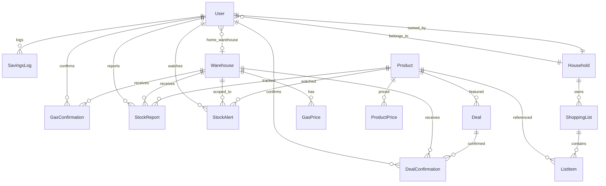

# BulkWise -- Data Model

## Prisma Schema (`prisma/schema.prisma`)

```prisma
generator client {
  provider = "prisma-client-js"
}

datasource db {
  provider = "postgresql"
  url      = env("DATABASE_URL")
}

model User {
  id               String   @id @default(uuid())
  email            String   @unique
  name             String
  avatarUrl        String?
  googleId         String   @unique
  membershipNumber String?
  isPremium        Boolean  @default(false)
  householdId      String?
  homeWarehouseId  String?
  createdAt        DateTime @default(now())
  updatedAt        DateTime @updatedAt

  household        Household?         @relation("HouseholdMembers", fields: [householdId], references: [id], onDelete: SetNull)
  ownedHousehold   Household?         @relation("HouseholdOwner")
  homeWarehouse    Warehouse?         @relation(fields: [homeWarehouseId], references: [id], onDelete: SetNull)
  gasConfirmations GasConfirmation[]
  stockReports     StockReport[]
  dealConfirms     DealConfirmation[]
  savingsLogs      SavingsLog[]
  stockAlerts      StockAlert[]

  @@index([householdId])
  @@index([homeWarehouseId])
  @@index([isPremium])
}

model Household {
  id         String   @id @default(uuid())
  name       String
  ownerId    String   @unique
  inviteCode String   @unique
  createdAt  DateTime @default(now())
  updatedAt  DateTime @updatedAt

  owner   User           @relation("HouseholdOwner", fields: [ownerId], references: [id], onDelete: Cascade)
  members User[]         @relation("HouseholdMembers")
  lists   ShoppingList[]

  @@index([ownerId])
  @@index([inviteCode])
}

model Warehouse {
  id        String   @id @default(uuid())
  name      String
  address   String
  city      String
  state     String
  zip       String
  lat       Float
  lng       Float
  hasGas    Boolean  @default(true)
  createdAt DateTime @default(now())
  updatedAt DateTime @updatedAt

  gasPrices    GasPrice[]
  gasConfirms  GasConfirmation[]
  stockReports StockReport[]
  dealConfirms DealConfirmation[]
  homeUsers    User[]
  stockAlerts  StockAlert[]

  @@index([state])
  @@index([zip])
  @@index([lat, lng])
  @@index([hasGas])
}

model GasPrice {
  id           String   @id @default(uuid())
  warehouseId  String
  price        Float
  grade        String   @default("regular")
  confirmCount Int      @default(1)
  confirmedAt  DateTime @default(now())
  createdAt    DateTime @default(now())

  warehouse Warehouse @relation(fields: [warehouseId], references: [id], onDelete: Cascade)

  @@unique([warehouseId, grade])
  @@index([warehouseId])
  @@index([grade])
  @@index([confirmedAt])
}

model GasConfirmation {
  id          String   @id @default(uuid())
  warehouseId String
  userId      String
  price       Float
  grade       String   @default("regular")
  confirmedAt DateTime @default(now())

  warehouse Warehouse @relation(fields: [warehouseId], references: [id], onDelete: Cascade)
  user      User      @relation(fields: [userId], references: [id], onDelete: Cascade)

  @@index([warehouseId])
  @@index([userId])
  @@index([grade])
  @@index([confirmedAt])
}

model Product {
  id        String   @id @default(uuid())
  name      String
  upc       String?  @unique
  category  String
  imageUrl  String?
  sizeValue Float?
  sizeUnit  String?
  unitLabel String?
  createdAt DateTime @default(now())
  updatedAt DateTime @updatedAt

  prices       ProductPrice[]
  stockReports StockReport[]
  deals        Deal[]
  listItems    ListItem[]
  stockAlerts  StockAlert[]

  @@index([category])
  @@index([upc])
  @@index([name])
}

model ProductPrice {
  id          String   @id @default(uuid())
  productId   String
  warehouseId String?
  price       Float
  unitPrice   Float?
  recordedAt  DateTime @default(now())

  product Product @relation(fields: [productId], references: [id], onDelete: Cascade)

  @@index([productId])
  @@index([warehouseId])
  @@index([recordedAt])
}

model StockReport {
  id          String   @id @default(uuid())
  productId   String
  warehouseId String
  userId      String
  status      String
  reportedAt  DateTime @default(now())

  product   Product   @relation(fields: [productId], references: [id], onDelete: Cascade)
  warehouse Warehouse @relation(fields: [warehouseId], references: [id], onDelete: Cascade)
  user      User      @relation(fields: [userId], references: [id], onDelete: Cascade)

  @@index([productId])
  @@index([warehouseId])
  @@index([userId])
  @@index([status])
  @@index([reportedAt])
}

model Deal {
  id            String   @id @default(uuid())
  productId     String
  title         String
  imageUrl      String?
  category      String
  salePrice     Float
  originalPrice Float
  savings       Float
  unitPrice     Float?
  unitLabel     String?
  startsAt      DateTime
  expiresAt     DateTime
  confirmCount  Int      @default(0)
  createdAt     DateTime @default(now())
  updatedAt     DateTime @updatedAt

  product  Product            @relation(fields: [productId], references: [id], onDelete: Cascade)
  confirms DealConfirmation[]

  @@index([productId])
  @@index([category])
  @@index([startsAt])
  @@index([expiresAt])
}

model DealConfirmation {
  id          String   @id @default(uuid())
  dealId      String
  warehouseId String
  userId      String
  confirmedAt DateTime @default(now())

  deal      Deal      @relation(fields: [dealId], references: [id], onDelete: Cascade)
  warehouse Warehouse @relation(fields: [warehouseId], references: [id], onDelete: Cascade)
  user      User      @relation(fields: [userId], references: [id], onDelete: Cascade)

  @@unique([dealId, userId])
  @@index([dealId])
  @@index([warehouseId])
  @@index([userId])
}

model ShoppingList {
  id          String   @id @default(uuid())
  name        String
  householdId String
  createdAt   DateTime @default(now())
  updatedAt   DateTime @updatedAt

  household Household  @relation(fields: [householdId], references: [id], onDelete: Cascade)
  items     ListItem[]

  @@index([householdId])
  @@index([updatedAt])
}

model ListItem {
  id            String   @id @default(uuid())
  listId        String
  productId     String?
  name          String
  thumbnailUrl  String?
  quantity      Int      @default(1)
  unitPrice     Float?
  unitLabel     String?
  price         Float?
  couponId      String?
  couponSavings Float    @default(0)
  checked       Boolean  @default(false)
  createdAt     DateTime @default(now())
  updatedAt     DateTime @updatedAt

  list    ShoppingList @relation(fields: [listId], references: [id], onDelete: Cascade)
  product Product?     @relation(fields: [productId], references: [id], onDelete: SetNull)

  @@index([listId])
  @@index([productId])
  @@index([checked])
}

model SavingsLog {
  id       String   @id @default(uuid())
  userId   String
  source   String
  amount   Float
  note     String?
  loggedAt DateTime @default(now())

  user User @relation(fields: [userId], references: [id], onDelete: Cascade)

  @@index([userId])
  @@index([source])
  @@index([loggedAt])
}

model StockAlert {
  id          String   @id @default(uuid())
  userId      String
  productId   String
  warehouseId String
  active      Boolean  @default(true)
  createdAt   DateTime @default(now())

  user      User      @relation(fields: [userId], references: [id], onDelete: Cascade)
  product   Product   @relation(fields: [productId], references: [id], onDelete: Cascade)
  warehouse Warehouse @relation(fields: [warehouseId], references: [id], onDelete: Cascade)

  @@unique([userId, productId, warehouseId])
  @@index([userId])
  @@index([productId])
  @@index([warehouseId])
  @@index([active])
}
```

## Entity Relationship Diagram



## Index Summary

| Model | Indexed columns | Unique constraints |
|---|---|---|
| User | householdId, homeWarehouseId, isPremium | email, googleId |
| Household | ownerId, inviteCode | ownerId, inviteCode |
| Warehouse | state, zip, (lat, lng), hasGas | -- |
| GasPrice | warehouseId, grade, confirmedAt | (warehouseId, grade) |
| GasConfirmation | warehouseId, userId, grade, confirmedAt | -- |
| Product | category, upc, name | upc |
| ProductPrice | productId, warehouseId, recordedAt | -- |
| StockReport | productId, warehouseId, userId, status, reportedAt | -- |
| Deal | productId, category, startsAt, expiresAt | -- |
| DealConfirmation | dealId, warehouseId, userId | (dealId, userId) |
| ShoppingList | householdId, updatedAt | -- |
| ListItem | listId, productId, checked | -- |
| SavingsLog | userId, source, loggedAt | -- |
| StockAlert | userId, productId, warehouseId, active | (userId, productId, warehouseId) |
